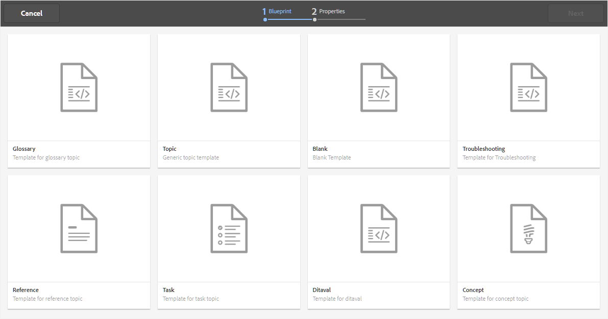

# Criar tópicos {#id2056AL00O5Z}

AEM Guias permitem criar tópicos DITA do tipo — tópico, tarefa, conceito, referência, glossário, DITAVAL e muito mais. Além de criar tópicos com base nos modelos prontos para uso, você também pode definir seus modelos personalizados. Para obter mais informações sobre como usar seus modelos DITA personalizados, consulte *Configurar modelos e tags para criação* em Instalar e configurar os Guias do Adobe Experience Manager as a Cloud Service.

Execute as seguintes etapas para criar um tópico:

1. Na interface do usuário do Assets, navegue até o local onde deseja criar o tópico.

1. Para criar um novo tópico, clique em **Criar** \> **Tópico DITA**.

1. Na página Blueprint, selecione o tipo de documento DITA que deseja criar e clique em **Próximo**.

   {width="800" align="left"}

   Por padrão, os Guias AEM fornecem os modelos de tópicos DITA mais usados. Você pode configurar mais modelos de tópicos de acordo com seus requisitos organizacionais, consulte *Configurar modelos e tags para criação* em Instalar e configurar os Guias do Adobe Experience Manager as a Cloud Service.

   >[!NOTE]
   >
   > Na exibição de lista da interface do usuário do Assets, o tipo de tópico DITA é mostrado na coluna Tipo como Tópico, Tarefa, Conceito, Referência, Glossentry ou DITAVAL. O mapa DITA é mostrado como Mapa.

1. Na página Propriedades , especifique o documento **Título**.

1. \(Opcional\) Especifique o arquivo **Nome**.

   Se o administrador tiver configurado o nome automático do arquivo com base na configuração da UUID, você não verá a opção para especificar o nome do arquivo. Um nome de arquivo baseado em UUID é automaticamente atribuído ao arquivo.

   Se a opção de nomenclatura de arquivo estiver disponível, o nome também será sugerido automaticamente com base no **Título** do seu documento. Se você quiser especificar manualmente o nome do documento, certifique-se de que **Nome** não contém espaços, apóstrofe ou chaves e termina com .xml ou dita. Por padrão, os Guias AEM substituem todos os caracteres especiais por hífens. Consulte a seção Nomes de arquivo no guia de práticas recomendadas para obter as práticas recomendadas de nomeação de arquivos DITA.

1. Clique em **Criar**. A mensagem Tópico criado é exibida.

   Você pode optar por abrir o tópico para edição no Editor da Web ou salvar o arquivo de tópico no repositório AEM.

   Todos os novos tópicos que você criar na interface do usuário do Assets **Criar** \> **Tópico DITA** ou o Editor da Web recebe uma ID de tópico exclusiva. O valor dessa ID é o próprio nome do arquivo. Além disso, um novo documento é salvo como a cópia de trabalho mais recente do tópico no DAM. Até salvar uma revisão de um tópico recém-criado, você não verá nenhum número de versão no Histórico de versões. Se você abrir o tópico para edição, as informações da versão serão mostradas no canto superior direito da guia do arquivo de tópico:

   {width="550" align="left"}

   As informações de versão de um tópico recém-criado são mostradas como *nenhum*. Ao salvar uma nova versão, é atribuído um número de versão como 1.0. Para obter mais informações sobre como salvar uma nova versão, consulte [Salvar como nova versão](web-editor-features.md#save-as-new-version-id209ME400GXA).

>[!NOTE]
>
> Se o administrador configurou o Editor da Web para fazer check-out dos arquivos antes da edição, você não poderá editar um arquivo até fazer check-out. Da mesma forma, se configurado, você será solicitado a fazer check-in de qualquer arquivo com check-out antes de fechá-lo.

>[!IMPORTANT]
>
> Depois de criar o tópico do DITA, salve as alterações na cópia de trabalho e crie uma nova versão depois de concluir as atualizações do tópico.

**Tópico principal:**[ Criar e visualizar tópicos](create-preview-topics.md)

