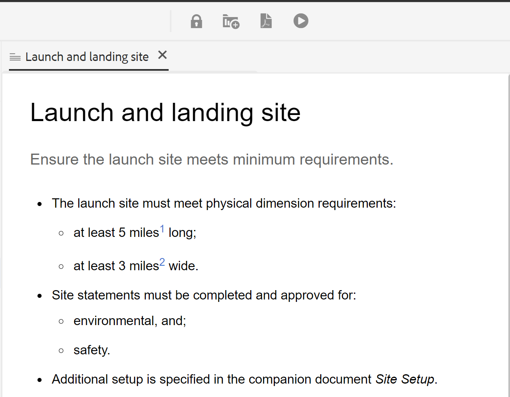

# Estado do documento {#id1821HC00URO}

Para gerenciar a prontidão dos documentos, os Guias AEM fornecem propriedade de estado do documento para indicar o estado atual do documento. Os estados de documentos ajudam você a descobrir rapidamente se um documento é novo, em revisão ou no estado de revisão concluído.

## Tipos de estados do documento

Um documento pode ter qualquer um dos estados do documento definidos no perfil Estado do documento. Por exemplo, um documento pode ter qualquer um dos seguintes Estados de documento:

- Rascunho - Indica que o documento foi criado e salvo com novas alterações.
- Em revisão - Indica que um fluxo de trabalho de revisão foi iniciado para o documento.
- Revisado - Indica que o documento foi revisado pelos usuários pretendidos.

Esses estados são definidos manual ou automaticamente de acordo com as configurações de perfil Estados do documento. Por exemplo, se o perfil Estado do documento estiver configurado com o estado inicial como Rascunho e o estado Em revisão for definido para documentos sob revisão. Em seguida, quando você cria um documento, o estado do documento é definido como *Rascunho*. Se você iniciar uma tarefa de revisão, o estado do documento será alterado para Em revisão.

Também é possível alterar manualmente o estado do documento para um ou vários documentos. No entanto, se você optar por alterar o estado do documento para vários documentos, o estado permitido será determinado pelos estados comuns permitidos para os documentos selecionados. Por exemplo, digamos que você tenha definido os estados do documento como Rascunho, Em revisão, Revisado e Pronto para publicar, na mesma ordem. No documento um.dita, o estado está definido como *Rascunho* e no documento dois.dita, o estado é definido como Reviewed. Quando você seleciona—one.dita e two.dita, o estado do documento permitido será *Pronto para publicar*. Como dois.dita está em *Revisado* estado, o próximo estado possível para two.dita é somente *Pronto para publicar*, que é exibido quando ambos os documentos são selecionados.

>[!NOTE]
>
> Um documento pode existir em apenas um estado por vez.

## Alterar estado do documento

Para alterar o estado de um documento, execute as seguintes etapas:

1. Na interface do usuário do Assets, selecione mais um documento para o qual deseja alterar o estado do documento.
1. Na barra de ferramentas principal, clique em **Propriedades**.
1. Selecione o novo estado no **Estado do documento** lista suspensa. Você pode selecionar apenas os estados do documento permitidos na seção Transição de Estado do perfil de Estado do Documento.

   >[!NOTE]
   >
   >Os administradores podem ver todos os estados do documento e alterar o documento para qualquer estado possível.

1. Clique em **Salvar e fechar**.

## Exibir estado do documento

A exibição de cartão da interface do usuário do Assets mostra o estado atual junto com a data e o tamanho de criação do respectivo tópico DITA ou mapa DITA.

{width="800" align="left"}

## Usar estados de documento no DDLC

Os estados de documentos desempenham um papel importante no gerenciamento do ciclo de vida dos documentos no DDLC. Se sua organização seguir rigorosamente o DDLC, ter um mecanismo para controlar documentos de edição com base em seu estado se tornará um recurso essencial. Por exemplo, você pode permitir a edição de documentos quando eles estiverem em *Rascunho* ou *Na revisão* estados. No entanto, uma vez que um documento seja revisto e esteja pronto para publicar, deverá existir uma forma de evitar novas alterações de documentos.

AEM Guias fornece fluxo de trabalho de aprovação de documento, que ajuda você a controlar o ciclo de vida do seu processo de desenvolvimento de documento. Quando um documento estiver pronto para publicar ou atingir o penúltimo estado, você poderá marcá-lo como aprovado. Depois que um documento é aprovado, AEM Guias cria uma nova versão do documento e o torna somente leitura. Em seguida, você pode mover o documento para publicação ou criar uma linha de base para processamento adicional.

Para iniciar um novo formulário de versão dos documentos marcados como aprovados, um autor deve iniciar uma nova versão. Iniciar uma nova versão altera o estado do documento para *Rascunho* novamente. Alterando o estado do documento para *Rascunho*, o documento será editável novamente e você poderá continuar trabalhando na próxima versão.

Para usar o recurso de aprovação do documento, execute as seguintes etapas:

>[!NOTE]
>
> O recurso de fluxo de trabalho de aprovação deve ser habilitado pelo administrador. Para obter mais detalhes, consulte *Ativar fluxo de trabalho de aprovação* na seção Instalar e configurar os guias do Adobe Experience Manager as a Cloud Service.

1. No Editor da Web, abra o documento que deseja marcar para aprovação.

1. Clique no botão **Marca aprovada**&#x200B;ícone .

1. Se o documento estiver no estado para ser marcado como aprovado, a seguinte caixa de diálogo será exibida:

   {width="550" align="left"}

   Se o documento não puder ser marcado como aprovado, a seguinte mensagem será exibida:

   {width="550" align="left"}

1. Se o documento estiver pronto para ser marcado como aprovado, selecione um rótulo na lista suspensa e clique em **Aprovar**.

   >[!NOTE]
   >
   > Se o administrador não tiver configurado uma lista predefinida de rótulos, você verá um campo de texto de forma livre para inserir um rótulo.

1. Depois que o documento for marcado com êxito como aprovado, um **Visualizar** do documento é mostrado no modo somente leitura.

   {width="650" align="left"}

   >[!NOTE]
   >
   > No modo Visualização , todas as opções de edição são removidas da barra de ferramentas. Além disso, a exibição Autor e Origem do documento também foi removida da navegação superior.

Depois que um documento é marcado como aprovado, ele não está mais disponível para edição. Se você quiser usar o documento para a próxima versão, será necessário trazê-lo de volta ao *Rascunho* estado. Para alterar o estado do documento de um documento aprovado de volta para *Rascunho* execute as seguintes etapas:

1. Em um documento aprovado, clique no botão **Iniciar uma nova versão** Ícone .

   A mensagem Iniciar nova versão é exibida.

1. Clique em **Confirmar**.

   O estado do documento é alterado para Rascunho e o documento é aberto no Editor da Web no modo de edição.

**Tópico principal:**[ Trabalhar com o editor da Web](web-editor.md)

