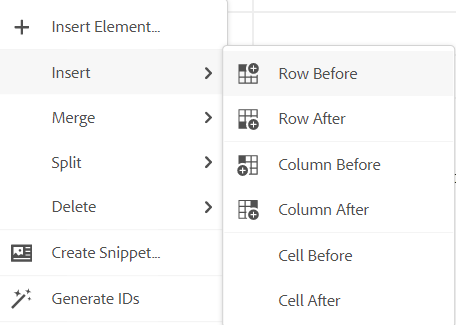
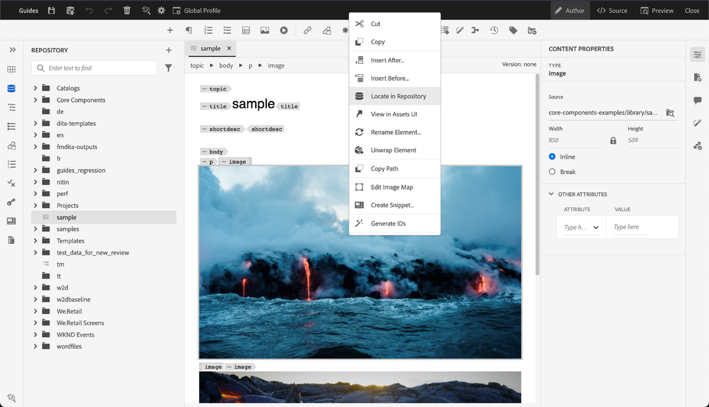
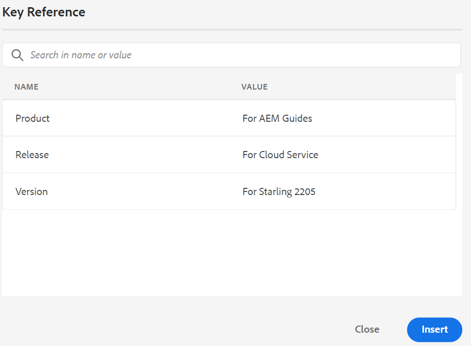
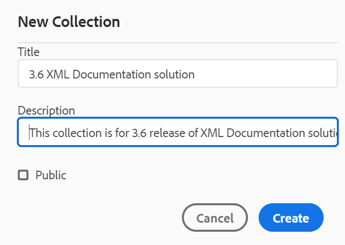
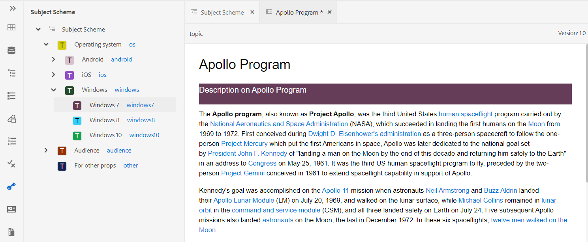
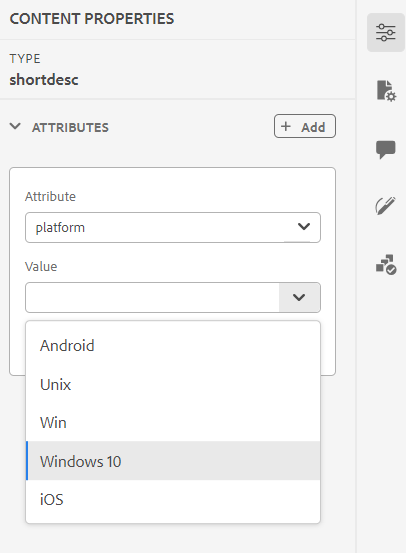
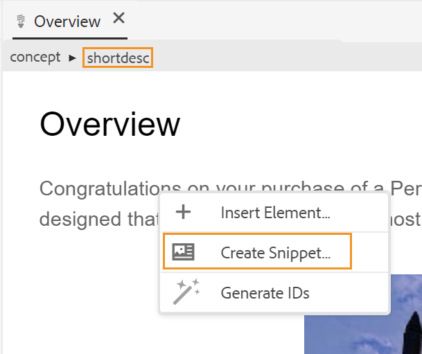
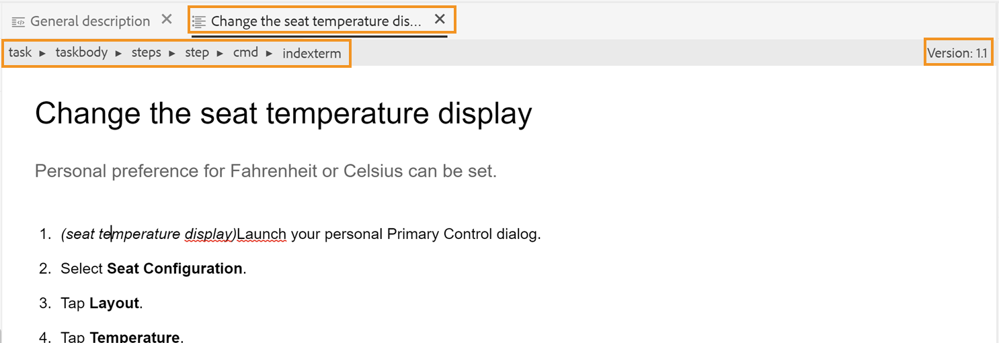

# Conhecer os recursos do Editor da Web {#id176NC500V5Z}

Esta seção aborda os vários recursos disponíveis no Editor da Web. Podemos dividir o Editor Web nas seguintes seções ou áreas:

- [Barra de ferramentas principal](#id2051EA0G05Z)
- [Barra de ferramentas secundária](#id2051EA0J0Y4)
- [Painel esquerdo](#id2051EA0M0HS)
- [Área de edição de conteúdo](#id2051EB000UI)
- [Painel direito](#id2051EB003YK)

A subseção a seguir detalha as várias seções do Editor da Web.

## Barra de ferramentas principal {#id2051EA0G05Z}

A barra de ferramentas principal está na parte superior da interface do Editor da Web e fornece recursos no nível de arquivo e vários modos de criação disponíveis no Editor da Web. Os recursos disponíveis na barra de ferramentas superior são explicados da seguinte maneira:

**Salvar Tudo** - 

Salva as alterações que você fez em todos os tópicos abertos. Se você tiver vários tópicos abertos no Editor da Web, clique em **Salvar tudo** ou usando a **Crtl**+**S** teclas de atalho salvam todos os documentos em um único clique. Não é necessário salvar cada documento individualmente.

>[!NOTE]
>
> A operação Save não cria uma nova versão dos tópicos. Para criar uma nova versão, escolha Salvar como nova versão.

**Salvar como nova versão** - 

Salva as alterações que você fez no tópico e também cria uma nova versão do tópico. Se você estiver trabalhando em um tópico criado recentemente, as informações da versão serão mostradas como **nenhum**.

{width="800" align="left"}

O número da versão muda com cada nova versão criada para o tópico ou arquivo de mapa.

Quando você escolhe salvar um tópico ou mapear usando **Salvar como nova versão**, a seguinte caixa de diálogo é exibida:

{width="300" align="left"}

Insira comentários e rótulos de versão para identificar as alterações e clique em **Salvar** para criar uma nova versão do arquivo.

Ao escolher a variável *Salvar como nova versão*, a primeira versão do tópico é criada no DAM, que também se torna a versão ativa atual do tópico. Posteriormente, se você reverter para uma versão mais antiga do tópico, essa se tornará a versão ativa atual do tópico.

Se o administrador tiver rótulos de versão pré-configurados, você verá esses rótulos em uma lista suspensa. Você pode escolher um rótulo na lista de rótulos disponíveis e salvar o documento.

{width="300" align="left"}

No momento de salvar um tópico, você pode adicionar um comentário especificando as alterações feitas no tópico. Esse comentário é mostrado no Histórico de versão do tópico.

Se o tópico estiver sob revisão, seus revisores receberão uma notificação informando que uma versão mais recente do tópico está disponível. Eles podem acessar facilmente a revisão mais recente do seu documento e continuar revisando a versão mais recente do seu tópico.

Ao passar o ponteiro do mouse sobre o título de um tópico, é mostrado o caminho do arquivo e o número da versão.

{width="800" align="left"}

>[!NOTE]
>
> Quando uma versão do seu tópico estiver disponível, você também poderá adicionar rótulos ao seu tópico. Esses rótulos podem ser usados para criar uma linha de base para publicar uma versão específica do documento. Para obter mais informações sobre como usar rótulos em seus tópicos, consulte [Usar rótulos](web-editor-use-label.md#).

**Desfazer e Refazer** -  / 

Desfazer ou Refazer a última ação.

**Excluir elemento** - 

Exclui o elemento selecionado no momento ou o elemento no qual o cursor está colocado.

**Localizar e substituir** - 

O recurso Localizar e substituir está disponível nos modos de exibição Autor e Origem. A barra de texto Localizar e substituir aparece na parte inferior da área de edição de tópicos. Você pode usar as teclas de atalho **CTRL**+**F** para chamar a barra Localizar e substituir.

{width="800" align="left"}

Uso do ícone de configurações \(\), você pode alternar a variável **Ignorar maiúsculas e minúsculas** e **Somente palavra inteira** opções de pesquisa. Para executar a pesquisa que não diferencia maiúsculas de minúsculas, ative \(ou selecione\) a variável **Ignorar maiúsculas e minúsculas** opção. Caso contrário, se você deseja executar a pesquisa que diferencia maiúsculas e minúsculas, desative \(ou desmarque\) a variável **Ignorar maiúsculas e minúsculas** opção. Também é possível optar por pesquisar uma palavra inteira.

A pesquisa é instantânea, o que significa que à medida que você digita a frase de pesquisa ou a palavra na variável **Localizar** , o termo é imediatamente pesquisado e selecionado no tópico. Da mesma forma, para substituir um texto em seu tópico, insira o termo de pesquisa e sua substituição nos respectivos campos e clique no botão **Substituir** ou **Substituir tudo** botão.

Na exibição Origem, a opção Localizar e Substituir é extremamente útil para procurar um elemento ou atributo específico. Por exemplo, se você quiser substituir o valor da variável `@product` , pode ser facilmente feito na exibição Origem. A exibição Autor não permite pesquisar com base em um atributo ou elemento. No entanto, você deve ter cuidado ao usar a variável **Substituir tudo** , pois pode substituir o código XML.

**Configurações do editor** - 

As Configurações do editor só estão disponíveis para usuários administrativos. Usando as preferências, um administrador pode definir as seguintes configurações:

>[!NOTE]
>
> Se estiver atualizando qualquer configuração padrão, você deverá reabrir os documentos para que as alterações entrem em vigor.

- **Geral**: As configurações Gerais permitem que você configure o dicionário para usar com o Editor da Web. Esta guia contém três seções: **Verificação Ortográfica**, **Condição** e **Criação**.

   {width="650" align="left"}

   - **Verificação Ortográfica**: Há duas opções... **Verificação Ortográfica AEM** e **Verificação ortográfica do navegador**. Por padrão, o editor usa o recurso Verificação ortográfica do navegador , onde a verificação ortográfica é executada usando o dicionário integrado do navegador. Você pode alternar para AEM Verificação ortográfica para usar AEM dicionário, que também pode ser personalizado para adicionar sua lista de palavras personalizada. Para obter mais informações sobre como personalizar AEM dicionário, consulte *Personalizar AEM dicionário padrão* na seção Instalar e configurar os guias do Adobe Experience Manager as a Cloud Service.


   - **Condição**

      - **Realçar texto condicional na exibição do autor**: Selecione essa opção para realçar o texto condicional na visualização do autor. O conteúdo condicional é realçado usando a cor definida para a condição.

      - **Validar com atributos de condição**: Selecione essa opção para permitir a validação dos valores definidos para os atributos. Isso evita que você adicione um valor incorreto.

      - **Mostrar a chave com o título no painel Esquema de assunto**: Selecione essa opção para mostrar as chaves, juntamente com os títulos do esquema de assunto. Se você não selecionar essa opção, somente os títulos serão exibidos. Por exemplo, aqui as chaves &quot;os&quot;, &quot;público-alvo&quot; e &quot;outro&quot; também são mostradas junto com os títulos.

         {width="550" align="left"}

      - **Mostrar esquema de assunto no painel Condições**: Selecione essa opção para ver um esquema de assunto no painel Condições. Se você desmarcar isso, as condições definidas serão mostradas no painel Condições .
   - **Criação**

      - **Habilitar Substituir tudo**: Selecione essa opção para ver o ícone Substituir tudo no painel Localizar e substituir .


**Painéis**: Essa configuração controla os painéis exibidos no painel esquerdo do editor. Você pode alternar o switch para mostrar ou ocultar o painel desejado.

{width="650" align="left"}

>[!NOTE]
>
> Se um painel personalizado tiver sido configurado, ele também aparecerá na lista de painéis. Você pode alternar o switch para mostrar ou ocultar o painel personalizado. Para obter mais detalhes sobre a configuração, consulte o *Configure um painel personalizado no painel esquerdo* na seção Instalar e configurar os guias do Adobe Experience Manager as a Cloud Service.

- **Lista de elementos**: Como administrador, você pode controlar a lista de elementos que um autor pode inserir usando o [Inserir elemento](#id204SG30105Z) e também defina o nome de exibição do elemento. A configuração Lista de elementos permite especificar o nome do elemento de acordo com as especificações DITA e um rótulo que você deseja usar em vez do nome do elemento definido DITA:

   {width="650" align="left"}

Na captura de tela acima, a variável `b` um elemento recebeu um rótulo de Negrito, `codeblock` recebe um rótulo de Bloco de código junto com alguns outros elementos. Se você selecionar a variável **Usar apenas elementos acima** , somente os elementos válidos \(no ponto de inserção atual\) dessa lista serão mostrados no pop-up Inserir elemento .

Na captura de tela a seguir, apenas 3 de 4 elementos configurados da captura de tela anterior são mostrados no contexto atual:

{width="300" align="left"}

- **Lista de atributos**: Semelhante à Lista de elementos, é possível controlar a lista de atributos e seus nomes de exibição a serem exibidos na lista de atributos de um elemento. Na captura de tela a seguir, apenas 3 atributos foram configurados para serem mostrados na lista de atributos de um elemento:

{width="650" align="left"}

Com essa configuração, ao tentar adicionar um atributo a um elemento, você verá apenas a lista de atributos configurados na lista.

{width="300" align="left"}

- **Exibir atributos**: Como a Lista de atributos, você pode controlar a lista de atributos a serem exibidos na lista de atributos de um elemento. Por padrão, quatro **Exibir atributos** — público-alvo, plataforma, produto e props foram configurados para serem mostrados na lista de atributos de um elemento. Você também pode adicionar um atributo de exibição usando a variável **Adicionar** ícone na parte superior. Também é possível excluir qualquer um dos atributos de exibição usando o **Excluir** ícone .

Os atributos definidos para um elemento são exibidos na exibição Layout e Contorno.

{width="550" align="left"}

- **Tradução**: Esta guia contém a opção para propagar os rótulos de origem para a versão de destino.

   - **Propagar rótulos de versão de origem para a versão de destino**: Selecione essa opção para passar o rótulo da versão do arquivo de origem para o arquivo traduzido. Por padrão, isso está desativado.

   {width="550" align="left"}


**Preferências de usuário** - 

As Preferências de usuário estão disponíveis para todos os autores. Usando as preferências, um autor pode definir as seguintes configurações:

{width="550" align="left"}

- **Tema**: Você pode escolher entre os temas Claro, Mais Claro, Mais Escuro ou Mais Escuro para o editor. No caso do tema mais claro, as barras de ferramentas e os painéis usam um plano de fundo de cor cinza mais claro. No caso do tema Luz, as barras de ferramentas e os painéis usam o fundo de cor cinza-claro. No caso do tema mais escuro, as barras de ferramentas e os painéis usam um plano de fundo preto mais escuro. No caso de um tema escuro, as barras de ferramentas e os painéis usam o fundo preto de cor. Em todos os temas, a área de edição de conteúdo é mostrada em fundo de cor branca.

- **Perfis de pasta**: O Perfil da pasta controla várias configurações relacionadas a atributos condicionais, modelos de criação, predefinições de saída e configurações do Editor da Web. O Perfil global é exibido por padrão. Além disso, se o administrador configurou perfis de pastas no sistema, esses perfis de pastas também serão mostrados na lista Perfis de pastas .

   As configurações do Editor da Web que um administrador pode definir no perfil da pasta incluem: personalizar a interface do usuário, incluindo os ícones da barra de ferramentas, o layout do Editor da Web, os trechos e o mapa-raiz. Para obter mais detalhes, consulte *Configurar perfis globais ou de nível de pasta* no as a Cloud Service Instalar e configurar os guias do Adobe Experience Manager .

   >[!NOTE]
   >
   > O nome do Perfil da pasta atual é exibido como um rótulo para o ícone Preferências do usuário na barra de ferramentas principal.

- **Caminho básico**: Por padrão, ao acessar o repositório de AEM no Editor da Web, você verá ativos do local /content/dam. Sua pasta de trabalho provavelmente terá algumas pastas dentro da pasta /content/dam/. Levaria alguns cliques para acessar a pasta de trabalho todas as vezes. Você pode definir o Caminho básico para sua pasta de trabalho e a Exibição do repositório, em seguida, mostra o conteúdo desse local antecipadamente. Isso reduz o tempo para acessar sua pasta de trabalho. Além disso, quando você insere qualquer referência ou arquivo de mídia em seu tópico, o local do navegador de arquivos começa com a pasta definida no Caminho básico.

- **Selecionar mapa raiz**: Selecione um arquivo de mapa DITA para resolver referências-chave ou entradas de glossário. O mapa-raiz selecionado tem a maior precedência para resolver referências-chave. Para obter mais detalhes, consulte [Resolver referências de chave](map-editor-other-features.md#id176GD01H05Z).


>[!NOTE]
>
> Se não quiser usar nenhum mapa raiz, verifique se a variável **Selecionar mapa raiz** estiver em branco.

**Modos Autor, Origem e Visualização**

Para obter detalhes sobre os vários modos de criação e visualização de documento, consulte [Exibições do editor da Web](web-editor-views.md#).

## Barra de ferramentas secundária {#id2051EA0J0Y4}

A barra de ferramentas secundária é exibida quando você abre um tópico para edição no Editor da Web. Os recursos disponíveis na barra de ferramentas secundária são explicados da seguinte maneira:

**Inserir elemento** - 

Insere um elemento válido no local atual ou no próximo local válido. Se você estiver trabalhando dentro de um elemento de bloco como um `note`, em seguida, use o ícone Inserir elemento para inserir um novo elemento depois da variável `note` elemento. Na captura de tela a seguir, um elemento de nota foi inserido dentro do elemento p \(parágrafo\):

{width="800" align="left"}

Se você pressionar Enter no elemento da nota, um novo parágrafo será criado dentro do próprio elemento da nota. Para inserir um novo elemento fora da nota, clique no elemento p \(destacado na captura de tela\) na navegação estrutural dos elementos e clique no ícone Inserir elemento ou pressione ***Alt***+***Enter*** para abrir a janela pop-up Inserir elemento . Em seguida, selecione o elemento desejado e pressione Enter para inserir o elemento selecionado após o elemento da nota.

Você também pode adicionar um elemento entre dois elementos quando um cursor de bloco piscante for exibido.

{width="300" align="left"}

Por exemplo, se você estiver trabalhando em um tópico DITA e o cursor de bloco estiver piscando entre a descrição curta e o corpo, é possível adicionar `prolog` e, em seguida, adicione direitos autorais, autor e outros detalhes.

Outra maneira de inserir um novo elemento é usando o menu de contexto. Clique com o botão direito do mouse em qualquer lugar do documento para chamar o menu de contexto. Nesse menu, escolha Inserir elemento para exibir a caixa de diálogo Inserir elemento e escolha o elemento que deseja inserir.

{width="300" align="left"}

**Inserir parágrafo** - 

Insira o elemento de parágrafo no local válido atual ou próximo.

**Inserir/Remover Lista Numerada** - 

Cria uma lista numerada no local atual ou próximo válido. Se você estiver em uma lista numerada e clicar nesse ícone, o item será convertido em um parágrafo normal.

**Inserir/remover lista com marcadores** - 

Cria uma lista com marcadores no local válido atual ou no próximo. Se você estiver em uma lista com marcadores e clicar nesse ícone, o item será convertido em um parágrafo normal.

**Inserir tabela** - 

Insere uma tabela no local atual ou próximo válido. Clique no ícone Inserir tabela para abrir a caixa de diálogo Inserir tabela:

{width="550" align="left"}

É possível especificar o número de linhas e colunas necessárias na tabela. Para manter a primeira linha como cabeçalho da tabela, selecione a opção Definir primeira linha como cabeçalho. Para adicionar um título à tabela, insira-o no campo Title .

Depois que uma tabela é inserida, você pode modificar a tabela usando o menu de contexto.

{width="550" align="left"}

Usando o menu de contexto da tabela, é possível:

- Inserir células, linhas ou colunas

- Mesclar células nas direções direita e inferior

- Dividir células horizontal ou verticalmente

- Excluir células, linhas ou colunas

- Criar um trecho da tabela

- Gerar IDs


Também é possível definir atributos em várias células, linha inteira ou coluna de uma tabela. Por exemplo, para alinhar a célula da tabela, arraste e selecione a célula desejada. No painel Propriedades de conteúdo \(à direita\), a propriedade **Tipo** alterações em **Múltipla entrada**. Na seção Outros atributos , selecione o `@valign` atributo da lista suspensa de atributos. Na lista suspensa de valores, selecione o alinhamento de texto desejado que deseja aplicar nas células da tabela selecionada.

{width="800" align="left"}

**Inserir imagem** - 

Insere uma imagem no local atual ou próximo válido. Clique no ícone Inserir imagem para abrir a caixa de diálogo Inserir imagem e, em seguida, pesquise e selecione a imagem que deseja inserir.

>[!NOTE]
>
> Você também pode adicionar uma imagem, arrastando-a e soltando-a do sistema local no seu artigo. Nesse caso, o arquivo de imagem é adicionado usando o **Fazer upload de ativos** fluxo de trabalho.  Para obter mais detalhes, consulte a **Fazer upload de ativos** no [Painel esquerdo](web-editor-features.md#id2051EA0M0HS) seção.


{width="650" align="left"}

É possível adicionar imagem/Título de figura e Texto alternativo para a imagem na caixa de diálogo Inserir imagem.

Você pode pesquisar o arquivo de imagem necessário inserindo o nome do arquivo na barra Tipo para pesquisa na parte superior e também filtrar os resultados da pesquisa por Caminho \(para pesquisar em\), Coleções, Tipo de arquivo e Tags. Depois de encontrar o arquivo de imagem necessário, selecione o arquivo e clique em Selecionar para inserir a imagem no documento. É possível inserir vários formatos de arquivos de imagem, como `.png`, `.svg`, `.gif`, `.jpg`, `.eps`, `.ai`, `.psd`e muito mais.

Depois de inserir uma imagem, você pode alterar a altura, a largura, a disposição e os atributos do painel Propriedades de conteúdo. Clique em um arquivo de imagem e faça alterações no painel Propriedades do conteúdo no painel direito.

{width="800" align="left"}

O campo Source exibe a UUID do arquivo de imagem inserido. Você pode encontrar o caminho completo do arquivo de imagem inserido passando o ponteiro do mouse sobre o campo Source . O caminho é exibido na dica de ferramenta.

Você pode redimensionar uma imagem fornecendo o valor Altura ou Largura para o arquivo de imagem. A proporção da imagem é mantida automaticamente. Se desejar, você também pode optar por não manter a proporção do aspecto do arquivo de imagem clicando no ícone de bloqueio \(de Manter proporção do aspecto\) e fornecendo valores de Altura e Largura.

Você também pode especificar a configuração Posicionamento da imagem como Inline ou Break. Caso escolha usar a opção de posicionamento Quebra, é possível escolher onde alinhar a imagem \(Esquerda, Centro ou Direita\).

Você também pode adicionar outras propriedades para um arquivo de imagem selecionando as propriedades necessárias na variável **Atributos** campo.

>[!NOTE]
>
>Também é possível definir áreas clicáveis \(mapa de imagem\) na imagem. Para obter mais detalhes, consulte a **Inserir/Editar mapa de imagem** descrição do recurso na [Painel esquerdo](web-editor-features.md#id2051EA0M0HS) seção.

**Menu de contexto para arquivos de imagem ou mídia**

Você também pode executar algumas operações comuns para imagens e arquivos de mídia usando o menu de contexto. Clique com o botão direito do mouse em qualquer lugar da imagem para chamar o menu de contexto.

O menu de contexto fornece opções para recortar, copiar ou colar a imagem ou a mídia. Você pode inserir um elemento antes ou depois do elemento selecionado. Você também tem a opção de renomear ou desvincular um elemento. Você pode localizar a imagem ou a mídia selecionada no repositório ou visualizar o arquivo na interface do usuário do Assets.

As outras opções no menu de contexto permitem copiar o caminho, editar um mapa de imagem, criar um trecho ou gerar IDs para o elemento selecionado.

**Inserir multimídia** - 

Insere diferentes tipos de arquivos multimídia. Clique no ícone Inserir multimídia e escolha o tipo de arquivo que deseja inserir. Os formatos de multimídia compatíveis são:

- Arquivo de áudio
- Arquivo de vídeo
- YouTube
- Vimeo

Ao selecionar a opção Audio or Video file , é exibida a visualização do repositório para procurar e selecionar o arquivo desejado. Se você escolher YouTube ou Vimeo, a caixa de diálogo Inserir multimídia será exibida. Cole o link do arquivo de vídeo no campo Link da Web e clique em Inserir para adicionar o vídeo no local válido atual ou próximo no documento.

>[!NOTE]
>
> Ao adicionar um link de vídeo do YouTube, é necessário substituir a string `watch?v=` com `embed` no URL. Por exemplo, para adicionar um link de vídeo do YouTube: `https://www.youtube.com/**watch?v**=WlIKQOrmZcs`, é necessário adicioná-lo como: `https://www.youtube.com/**embed/**WlIKQOrmZcs`. Essa alteração garante que o vídeo seja incorporado na saída AEM Site e PDF.

Também é possível adicionar o arquivo de áudio ou vídeo na caixa de diálogo Inserir multimídia. Selecione a opção Arquivo de áudio/vídeo e clique no ícone de navegação para iniciar a visualização do repositório. Selecione o arquivo de áudio ou vídeo do repositório e clique em Selecionar para adicionar o link do arquivo no campo Arquivo de áudio/vídeo. Caso escolha um arquivo de vídeo, uma visualização do arquivo também será mostrada na área Visualização. Você pode reproduzir o arquivo de vídeo para visualizar.

{width="650" align="left"}

**Inserir referência cruzada** - 

Insira referências do tipo — Referência de conteúdo, Referência de chave de conteúdo, Referência de chave, Referência de arquivo, Link da Web ou Link de email.

Clique no botão **Selecionar arquivo** ícone \(para Referência de conteúdo e Referência de arquivo\) ou **Selecionar mapa** ícone \(para Referência da chave de conteúdo e Referência da chave\) e selecione o arquivo ou conteúdo desejado ao qual vincular.

{width="650" align="left"}

Um link da referência selecionada é adicionado ao documento. O menu de contexto no link oferece as opções para:

- **Inserir elemento**: Mostra uma lista de elementos válidos que podem ser inseridos no contexto especificado.
- **Copiar UUID**: Copia a UUID da referência inserida.
- **Copiar caminho**: Copia o caminho completo da referência inserida.
- **Criar trecho**: Cria um trecho reutilizável da referência inserida.
- **Gerar IDs**: Gera uma ID exclusiva para a referência inserida.

Você também pode pesquisar usando a UUID do arquivo que deseja referenciar. Para links de Referência de conteúdo e chave, insira a UUID do arquivo ao qual você deseja vincular e o arquivo é pesquisado automaticamente e exibido na seção Visualização . Ao especificar a UUID do arquivo, não é necessário mencionar explicitamente a extensão de arquivo para arquivos .xml. A extensão .xml é anexada automaticamente à UUID.

{width="650" align="left"}

Se o administrador tiver ativado a opção UUIDs em *XMLEditorConfig*, você verá a UUID do conteúdo referenciado no **Link** propriedade.

{width="800" align="left"}

>[!NOTE]
>
> Se a variável **Ativar UUIDs** não estiver ativada, então o caminho relativo do conteúdo referenciado será exibido.

>[!IMPORTANT]
>
> Mesmo que o caminho relativo do conteúdo referenciado seja mostrado na variável **Link** , internamente o link é criado usando o UUID do conteúdo referenciado.

>[!TIP]
>
> Consulte a seção Referências no guia de práticas recomendadas para obter as práticas recomendadas sobre referência de conteúdo.

**Pesquisa de filtro**

Você pode pesquisar por algum texto nos arquivos presentes no caminho selecionado do repositório AEM. Por exemplo, &quot;general&quot; é pesquisado na captura de tela fornecida abaixo. Também é possível restringir sua pesquisa usando filtros aprimorados. Você pode procurar todos os arquivos DITA, como Tópicos DITA e Mapas DITA, presentes no caminho selecionado.

Você pode pesquisar arquivos não DITA, como arquivos de imagem, multimídia e documentos no caminho selecionado. Também é possível pesquisar valores específicos nos atributos dos elementos DITA. Você também pode procurar arquivos com check-out feito pelo usuário especificado.

{width="650" align="left"}

>[!NOTE]
>
> O administrador do sistema também pode configurar os filtros de texto e mostrar ou ocultar outros filtros. Para obter mais detalhes, consulte a seção Configurar filtros de texto na as a Cloud Service Instalar e configurar guias do Adobe Experience Manager .

A lista de arquivos filtrados que contêm o texto pesquisado é exibida. Por exemplo, na captura de tela acima, os arquivos contendo o texto &quot;geral&quot; são listados. Você também pode visualizar o conteúdo do arquivo.

**Inserir conteúdo reutilizável** - 

Reutilize o conteúdo que existe em qualquer outro documento do seu projeto. Você pode inserir conteúdo vinculando-o diretamente ao conteúdo de um arquivo ou usando uma referência-chave, consulte [Resolver referências de chave](map-editor-other-features.md#id176GD01H05Z). Ao clicar no ícone Inserir conteúdo reutilizável, a caixa de diálogo Reutilizar conteúdo é exibida:

{width="650" align="left"}

Na caixa de diálogo Reutilizar conteúdo , selecione o arquivo DITA para referências de arquivo ou o arquivo de mapa DITA que contém as referências-chave. Depois de selecionado, o tópico ou as referências-chave são mostradas na caixa de diálogo. Você pode selecionar a ID/chave do tópico que deseja inserir e clicar em Concluído para inserir o conteúdo no seu tópico.

Para inserir a Referência de conteúdo, você também pode inserir a UUID do arquivo, e o conteúdo reutilizável desse arquivo é listado na seção Visualização .

Com base na configuração para inserir links, você pode ver a UUID do conteúdo inserido ou o caminho relativo no painel Propriedades ou na exibição do código-fonte. O link é sempre criado usando o UUID do conteúdo referenciado. Consulte Configurar links com base em UUID no guia Instalar e configurar o Adobe Experience Manager as a Cloud Service.

>[!NOTE]
>
> Para adicionar conteúdo antes ou depois do conteúdo referenciado, use *Alt*+*Left* Seta ou Alt+*Right* Teclas de seta para mover o cursor até o local desejado.

Você também pode incorporar o conteúdo referenciado dentro do tópico clicando com o botão direito do mouse no conteúdo referenciado e escolhendo **Substituir referência por conteúdo** no menu de contexto.

**Inserir caracteres especiais** -  

Insere caracteres especiais no tópico. Clique no ícone Inserir caractere especial para abrir a caixa de diálogo Inserir caractere especial.

>[!NOTE]
>
> AEM Guias fornece caixas de diálogo móveis e redimensionáveis. As caixas de diálogo que têm duas linhas cruzadas no canto inferior direito podem ser redimensionadas. As linhas cruzadas na caixa de diálogo Caractere especial são mostradas abaixo.

{width="550" align="left"}

Na caixa de diálogo Inserir caractere especial, é possível procurar por um caractere especial usando seu nome. Todos os caracteres especiais são armazenados em várias categorias. Use a lista suspensa Selecionar categoria e selecione uma categoria. Os caracteres especiais disponíveis na categoria selecionada são exibidos. É possível navegar pela lista de caracteres especiais usando as teclas de seta ou clicar no caractere desejado que deseja inserir. O Nome e o Código hexadecimal do caractere especial selecionado são exibidos abaixo da lista. Clique em Inserir para inserir o caractere selecionado no documento.

**Inserir palavra-chave** - 

Insira a palavra-chave definida no mapa DITA. Clique no ícone Inserir palavra-chave para abrir a caixa de diálogo Referência-chave .

{width="550" align="left"}

As palavras-chave são listadas em ordem alfabética e você também pode pesquisar por palavra-chave\(s\) digitando uma sequência de caracteres de pesquisa na caixa Pesquisar. O resultado da pesquisa retornará as palavras-chave que contêm a string na ID ou no Valor. As palavras-chave definidas no mapa DITA são listadas nessa caixa de diálogo. Escolha a palavra-chave que deseja inserir e clique em **Inserir**.

Você também pode alterar os atributos da palavra-chave inserida clicando com o botão direito do mouse na palavra-chave e selecionando a opção Atributos . A caixa de diálogo Atributos de palavra-chave é aberta:

{width="550" align="left"}

Você pode alterar os atributos da palavra-chave ou adicionar um novo atributo à palavra-chave.

**Inserir trecho** - 

Insira um trecho no local válido atual ou no próximo. Para que esse recurso funcione, é necessário ter trechos definidos no sistema. Para obter mais informações sobre como adicionar um trecho, consulte o **Snippet** descrição do recurso na [Painel esquerdo](web-editor-features.md#id2051EA0M0HS) seção.

Ao clicar no ícone Inserir trecho, é exibido o catálogo Inserir trecho. O catálogo diferencia o contexto, o que indica que mostrará os trechos somente se forem permitidos no local atual.

O exemplo a seguir mostra dois trechos pré-configurados - Aviso e Erro que podem ser inseridos no local atual no documento.

{width="300" align="left"}

Quando você escolhe um trecho da lista, ele é inserido no local atual ou próximo válido no documento. A captura de tela a seguir mostra o trecho Erro inserido no documento:

{width="400" align="left"}

**Inserir/Editar mapa de imagem** - 

Insere um mapa de imagem na imagem selecionada. Uma imagem com áreas clicáveis que se vinculam a tópicos ou páginas da Web é chamada de mapa de imagem.

Selecione uma imagem no tópico atual e clique no ícone Inserir/Editar mapa de imagem para abrir a caixa de diálogo Inserir mapa de imagem.

{width="650" align="left"}

Escolha a forma preferida Retângulo , Círculo ou Polígono  para definir uma área sobre uma imagem que você deseja usar como link. Após definir uma área, a caixa de diálogo Referência é exibida, onde é necessário especificar o link para o conteúdo interno ou externo:

{width="650" align="left"}

Se houver sobreposição de áreas, é possível trazer a forma para frente ou enviá-la para trás clicando no ícone correspondente na barra de ferramentas. Também é possível remover uma área ao selecioná-la e clicar no ícone Excluir . Clicar duas vezes em uma área abre a caixa de diálogo Referência , onde você pode alterar o link de destino. Depois de marcar as áreas necessárias na imagem, salve as alterações clicando em Concluído.

**Bloquear/Desbloquear** - / 

Bloqueia ou desbloqueia o arquivo atual. Bloquear \(ou verificar\) um arquivo dá ao usuário acesso exclusivo de gravação no arquivo. Quando o arquivo estiver Desbloqueado \(ou marcado\), as alterações serão salvas na versão atual do arquivo.

Se você estiver na Visualização de mapa e expandir o mapa pai, poderá bloquear todos os arquivos no mapa com um único clique. Basta expandir o arquivo de mapa pai e selecionar o arquivo pai, o que resulta na seleção de todos os arquivos no mapa. Em seguida, clique no ícone Bloquear para obter o bloqueio de todos os arquivos no mapa.

**Alternar exibição de tags** - 

Tags são dicas visuais que indicam os limites de um elemento. Um limite de elemento marca o início e o fim de um elemento. Em seguida, você pode usar esses limites como uma dica visual para colocar o ponto de inserção ou selecionar o texto dentro de um limite. Se quiser inserir outro elemento antes ou depois de um elemento no documento, você pode colocar o ponto de inserção antes ou depois do limite de abertura ou fechamento do elemento.

A captura de tela a seguir mostra um documento com a Exibição de tags em:

{width="650" align="left"}

As seguintes operações podem ser executadas em um documento com a Exibição de tags em:

- **Selecionar um elemento**: Clique na tag de abertura ou fechamento de um elemento para selecionar seu conteúdo.

- **Expandir ou recolher tags**: Clique no sinal de + ou - em uma tag para expandi-la ou recolhê-la.

- **Usar o menu de contexto**: O menu de contexto fornece opções para recortar, copiar ou colar o elemento selecionado. Você também pode inserir um elemento antes ou depois do elemento selecionado. As outras opções permitem Gerar ID ou abrir o painel Propriedades do elemento selecionado.

- **Arrastar e soltar elementos**: Selecione a tag de um elemento e arraste-a e solte-a facilmente no documento. Se o local para soltar for um local válido onde o elemento é permitido, o elemento é colocado no local para soltar.


>[!NOTE]
>
> Se um usuário ativar a Exibição de tags no Editor da Web, ela permanecerá ativada mesmo nas sessões. Isso significa que você não precisa habilitar a Exibição de tags novamente para acessá-la posteriormente. O valor padrão para a Exibição de tags de uma sessão de novo usuário é determinado pela propriedade tagsView no arquivo ui\_config.json. Para obter mais detalhes, consulte a *Configurar valor padrão para a Exibição de tags* em Instalar e configurar os Guias do Adobe Experience Manager as a Cloud Service.

**Ativar/Desativar Alterações de Rastreamento** 

Você pode acompanhar todas as atualizações feitas em um documento ativando o modo Rastrear alterações . Depois de ativar as alterações de rastreamento, todas as inserções e exclusões são capturadas no documento. Todo o conteúdo excluído é realçado usando o Strikethrough e todas as inserções são realçadas em texto de cor verde. Além disso, também é possível obter as barras de alteração na borda da página de tópico. Novamente, uma barra vermelha é mostrada para o conteúdo excluído e a barra verde é mostrada para o conteúdo adicionado. Caso haja adição e exclusão na mesma linha, as barras verde e vermelha serão exibidas.

A captura de tela a seguir destaca o conteúdo excluído e inserido junto com as barras de alteração:

{width="650" align="left"}

Um caso de uso típico para rastrear alterações em um documento pode ser para fazer a revisão por peer. Você pode ativar o rastreamento de alterações e compartilhar seu documento para revisão, o revisor então faz alterações com o rastreamento de alterações ativado. Ao receber o documento, você deve ter um mecanismo para exibir as atualizações sugeridas junto com uma maneira conveniente de aceitar ou rejeitar alterações.

AEM Guias fornece o recurso Alterações rastreadas que contém informações sobre as atualizações feitas no documento. O recurso Alterações rastreadas fornece informações sobre quais atualizações foram feitas, quem as fez e em que momento. Usando o recurso Alterações rastreadas , também é possível aceitar ou rejeitar facilmente as atualizações sugeridas no documento.

Para acessar o recurso, clique no ícone Tracking Changes no painel direito.

{width="300" align="left"}

Clicar em uma alteração seleciona o conteúdo alterado no documento. Você pode aceitar uma alteração selecionando o ícone Aceitar alteração ou rejeitá-la selecionando Rejeitar alteração.

Se desejar aceitar ou rejeitar todas as alterações com um único clique, selecione **Aceitar Tudo** ou **Rejeitar tudo**.

>[!NOTE]
>
> O modo de Visualização permite que você visualize o documento com ou sem as marcações do conteúdo alterado. Para obter mais detalhes, consulte a [Visualizar](web-editor-views.md#preview-mode-id19AAGL00163) modo.

**Mesclar** - 

Quando você trabalha em um ambiente de vários autores, fica difícil rastrear quais alterações os outros autores fizeram em um tópico ou mapa. O recurso Mesclar oferece mais controle sobre não apenas como visualizar as alterações, mas também sobre quais alterações são retidas na versão mais recente do documento.

**Mesclar arquivos de tópicos**

Para mesclar as alterações em um tópico, execute as seguintes etapas:

1. Abra um tópico no Editor da Web.

1. Clique em **Mesclar**.

   A caixa de diálogo Mesclar é exibida.

   {width="550" align="left"}

1. *\(Opcional\)* Você também pode navegar e selecionar um novo arquivo de algum outro local no seu repositório.

1. Selecione uma versão do arquivo com a qual deseja comparar a versão atual do arquivo.

1. Nas Opções, escolha:

   - **Rastrear Alterações Da Versão Selecionada**: Essa opção mostra todas as atualizações de conteúdo na forma de acompanhar as alterações. Em seguida, você pode optar por aceitar ou rejeitar alterações no documento, uma de cada vez ou todas de uma só vez.

   - **Reverter para a versão selecionada**: Essa opção reverte a versão atual do documento para a versão selecionada. Essa opção não oferece controle sobre qual conteúdo é aceito ou rejeitado.

1. Clique em **Concluído**.

1. Se você selecionou a variável **Rastrear alterado da versão selecionada** , todas as alterações da versão selecionada são mostradas no recurso Alterações rastreadas do painel direito.

   Você pode optar por aceitar ou rejeitar todos os comentários do painel Alterações rastreadas ou aceitar ou rejeitar comentários individuais.


**Mesclar arquivos de mapa**

Para mesclar as alterações em um arquivo de mapa, execute as seguintes etapas:

1. Abra um mapa no Editor da Web.

1. Clique em **Mesclar**.

   A caixa de diálogo Mesclar é exibida.

   {width="550" align="left"}

1. *\(Opcional\)* Você também pode navegar e selecionar um novo arquivo de algum outro local no seu repositório.

1. Selecione uma versão do arquivo com a qual deseja comparar a versão atual do arquivo.

1. Nas Opções, escolha:

   - **Rastrear Alterações Da Versão Selecionada**: Essa opção mostra todas as atualizações de conteúdo na forma de acompanhar as alterações. Em seguida, você pode optar por aceitar ou rejeitar alterações no documento, uma de cada vez ou todas de uma só vez.

   - **Reverter para a versão selecionada**: Essa opção reverte a versão atual do documento para a versão selecionada. Essa opção não oferece controle sobre qual conteúdo é aceito ou rejeitado.

1. Clique em **Concluído**.

   1. Se você selecionou a variável **Rastrear alterado da versão selecionada** , então todas as alterações da versão selecionada são mostradas no Painel de alteração rastreado \(à direita\).

      Você pode optar por aceitar ou rejeitar todas as alterações do painel Alterações rastreadas ou aceitar ou rejeitar alterações individuais no arquivo de mapa.


**Histórico da versão** - 

AEM Guias fornece várias maneiras de visualizar as versões criadas para seus arquivos de tópico e também maneiras de reverter para uma versão específica. No entanto, a maioria desses recursos está disponível fora do Editor da Web.

O recurso Histórico de versão no Editor da Web permite verificar não apenas as versões e rótulos disponíveis no tópico ativo, mas também oferece a flexibilidade de reverter para qualquer versão do próprio editor.

Para acessar o histórico de versões e reverter para uma versão específica do tópico, execute as seguintes etapas:

1. Abra um tópico no Editor da Web.

1. Clique em **Histórico da versão**.

   A caixa de diálogo Histórico da versão é exibida.

   {width="550" align="left"}

1. Escolha uma versão do tópico para a qual você deseja reverter na **Selecionar versão** lista suspensa.

   >[!NOTE]
   >
   > Se uma versão tiver rótulos aplicados a ela, elas também serão mostradas \(entre colchetes\) juntamente com o número da versão.

   Depois de escolher uma versão na lista suspensa, a opção Reverter para versão selecionada é disponibilizada. A janela de pré-visualização exibe as diferenças entre a versão atual e a versão selecionada do tópico.

   {width="550" align="left"}

1. Clique em **Reverter para a versão selecionada** para reverter sua cópia de trabalho com a versão selecionada do tópico.

   A caixa de diálogo Reverter versão é exibida.

   {width="550" align="left"}

1. \(*Opcional*\) Forneça um motivo para reverter para uma versão anterior. Você também pode criar uma nova versão da cópia ativa do tópico que está no momento.

1. Clique em **Confirme.**

   Sua cópia funcional do arquivo é revertida para a versão selecionada. Se você optar por criar uma nova versão da cópia de trabalho ativa no momento, uma nova versão do arquivo também será criada com todas as alterações de trabalho.


Quando você reverte para uma versão anterior, uma dica visual é mostrada, indicando que a versão em que você está trabalhando atualmente não é a versão mais recente.

{width="800" align="left"}

**Gerenciamento de etiqueta da versão** -  

Rótulos ajudam a identificar o estágio em que um tópico específico está no DDLC \(Document Development Life Cycle\). Por exemplo, ao trabalhar em um tópico, você pode definir o rótulo como &quot;Aprovado&quot;. Depois que um tópico é publicado e disponibilizado para os clientes, você pode atribuir o rótulo &quot;Lançado&quot; a esse tópico.

AEM Guias permite especificar rótulos em um formato de texto de forma livre ou usar um conjunto de rótulos predefinidos. O rótulo personalizado permitiria que qualquer autor no sistema especificasse um rótulo de acordo com sua escolha. Isto proporciona flexibilidade; no entanto, introduz rótulos inconsistentes no sistema. Para superar esse problema, os administradores podem configurar um conjunto de rótulos predefinidos. Para obter mais informações sobre como configurar rótulos predefinidos, consulte *Configurar e personalizar o XML Web Editor* no as a Cloud Service Instalar e configurar os guias do Adobe Experience Manager .

Esses rótulos são mostrados no formato de uma lista suspensa para os autores, onde quer que eles precisem especificar um rótulo. Isso garante que somente rótulos predefinidos e consistentes sejam usados no sistema.

Existem diferentes métodos através dos quais você pode aplicar rótulos aos seus tópicos - [Histórico da versão](web-editor-use-label.md#) painel na interface do usuário do Assets, [Linhas de base](/help/tutorials/user-guide/generate-output-use-baseline-for-publishing.md#id184KD0T305Z) Interface do usuário e Editor da Web. O recurso Rótulo da versão no Editor da Web oferece aos autores uma maneira rápida e fácil de atribuir rótulos a seus tópicos.

Para adicionar rótulos ao seu tópico no Editor da Web, execute as seguintes etapas:

1. Abra um tópico no Editor da Web.

1. Clique em **Rótulo da versão**.

   A caixa de diálogo Gerenciamento de Rótulo da Versão é exibida.

   {width="650" align="left"}

   A caixa de diálogo Gerenciamento de Rótulo da Versão é dividida em duas partes — o painel esquerdo tem uma lista de versões disponíveis para o tópico junto com a lista suspensa de rótulos \(ou uma caixa de texto para inserir um rótulo\) e o painel direito com uma visualização do tópico.

1. Selecione uma versão na qual deseja aplicar rótulos.

   Quando você escolhe uma versão diferente do tópico na lista da versão, o painel de visualização exibe as alterações entre a versão atual e a versão selecionada do tópico

   >[!NOTE]
   >
   > Se um rótulo já estiver aplicado em uma versão, ele será exibido ao lado do número da versão na lista suspensa e abaixo da lista Selecionar versão . Você pode remover um rótulo existente clicando em \(**x**\) ícone ao lado do rótulo.

1. Caso o administrador tenha definido uma lista de rótulos, você verá uma lista suspensa de rótulos onde poderá escolher os rótulos que deseja aplicar. Você pode selecionar vários rótulos na lista suspensa.

   Caso contrário, você verá uma caixa de texto, na qual poderá inserir os rótulos que deseja adicionar ao seu tópico.

   >[!NOTE]
   >
   > Não é possível aplicar o mesmo rótulo em várias versões de um tópico. Se tentar associar um rótulo existente, você terá a opção de removê-lo da versão existente e aplicá-lo na versão selecionada do tópico.

1. Clique em **Adicionar etiqueta**.

1. Na mensagem de confirmação Aplicar rótulo, selecione o **Mover Rótulo** opção para mover rótulos de uma versão existente para a versão selecionada. Se você não selecionar essa opção e houver rótulos atribuídos a uma versão diferente do tópico, eles não serão movidos para a versão do tópico selecionado. Esses rótulos são ignorados no processo do aplicativo de rótulo.


**Criar tarefa de análise** -  

Você pode criar uma tarefa de revisão do tópico atual ou mapear arquivo diretamente do Editor da Web. Abra o arquivo para o qual deseja criar a tarefa de revisão e clique em Criar Tarefa de Revisão para iniciar o processo de criação da revisão.

>[!NOTE]
>
> Você também pode criar uma tarefa de revisão no painel Revisar \(à direita\).

Siga as instruções fornecidas no [Rever tópicos ou mapas](review.md#) para obter mais detalhes.

## Painel esquerdo {#id2051EA0M0HS}

O painel esquerdo é um painel persistente. Você pode expandi-lo ou recolhê-lo clicando no ícone Expandir barra lateral \(\). Na exibição expandida, exibe os nomes dos ícones que aparecem como dicas de ferramentas na exibição recolhida.

>[!NOTE]
>
> O painel esquerdo é redimensionável. Para redimensionar o painel, trazer o cursor para o limite do painel, o cursor se transforma em uma seta de duas pontas, clique e arraste para redimensionar a largura do painel.

O painel esquerdo fornece acesso aos seguintes recursos:

**Favoritos** -  

Se você trabalhar em um conjunto de arquivos ou pastas, poderá adicioná-los à sua lista favorita para acessá-los rapidamente. A lista Favorita mostra a lista de documentos que você adicionou e outra lista de documentos favoritos publicamente acessível dos outros usuários.

Para criar uma lista ou coleção favorita, clique no ícone + ao lado do painel Favoritos para exibir o log de mídia Nova coleção :

{width="300" align="left"}

Insira um título e uma descrição para a coleção favorita que deseja criar. Se você selecionar **Público**, esse favorito também é exibido para outros usuários.

Para adicionar um arquivo à sua coleção favorita, use qualquer um dos seguintes métodos:

- Navegue até o arquivo ou pasta desejado na Exibição do Repositório, clique no botão *Opções* ícone para abrir o menu de contexto e escolha **Adicionar aos Favoritos**. Na caixa de diálogo Adicionar aos favoritos, você pode optar por adicionar o arquivo/pasta a um favorito existente ou criar um novo.

   {width="300" align="left"}

- Clique com o botão direito do mouse na guia de um arquivo no editor para abrir o menu de contexto. Choose **Adicionar a \> Favoritos** para adicionar o arquivo à lista de favoritos.

   {width="400" align="left"}


>[!NOTE]
>
> Para remover um item da lista de favoritos, clique no ícone Opções ao lado do arquivo ou pasta na lista Favoritos e escolha **Remover de Favoritos**.

**Exibição do Repositório** - 

Ao clicar no ícone Exibição do Repositório, você obtém uma lista de arquivos e pastas disponíveis no DAM.

75 arquivos são carregados de cada vez. Sempre que você clicar em **Carregar mais**.. 75 arquivos são carregados e o botão para de ser exibido quando todos os arquivos foram listados. Esse carregamento em lote é eficiente e você pode acessar os arquivos mais rápido em comparação ao carregamento de todos os arquivos existentes em uma pasta.

Você pode navegar facilmente para o arquivo necessário no DAM e abri-lo no Editor da Web. Se você tiver o acesso necessário para editar o arquivo, poderá fazê-lo.

Você também pode clicar e reproduzir um arquivo de áudio ou vídeo no Editor da Web. Você pode alterar o volume ou a visualização do vídeo. No menu de atalho, você também tem as opções para baixar, alterar a velocidade de reprodução ou exibir a imagem na imagem.


Clicar duas vezes em um arquivo de mapa o abre na **Exibição do mapa**. Para obter mais detalhes, consulte a **Exibição do mapa** descrição do recurso na [Painel esquerdo](web-editor-features.md#id2051EA0M0HS) seção. Clicar duas vezes em um arquivo de tópico o abre na [Área de edição de conteúdo](#id2051EB000UI). Ser capaz de navegar e abrir um arquivo diretamente do Editor da Web economiza tempo e aumenta a produtividade.

**Pesquisa de filtro**

O Editor da Web fornece filtros aprimorados para pesquisar texto. Clique na Pesquisa de filtro \(\)ícone para abrir o painel filtros. Você pode pesquisar um texto nos arquivos presentes no caminho selecionado do repositório AEM. Por exemplo, &quot;objetivo geral&quot; é pesquisado na captura de tela fornecida abaixo.

{width="400" align="left"}

Você também tem as seguintes opções para filtrar os arquivos e restringir sua pesquisa no repositório de AEM:

- **Arquivos DITA**: Você pode procurar por todos **Tópicos DITA** e **Mapas DITA** presente no caminho selecionado.
- **Arquivos não DITA**: Você pode procurar por **Arquivos de imagem**, **Multimídia** e **Documentos** no caminho selecionado.
- **Elementos DITA**: Também é possível pesquisar valores específicos nos atributos dos elementos DITA especificados.
- **Check-out por**: Você pode procurar por arquivos cujo check-out foi feito pelo usuário especificado.
- **Última modificação**: Você pode procurar arquivos que foram modificados pela última vez após uma data selecionada, mas antes de uma data selecionada. Você também pode procurar arquivos que foram modificados pela última vez nas últimas 2 horas, na última semana, no último mês ou no ano passado.
- **Tags**: Você pode procurar arquivos que tenham tags específicas aplicadas a eles. Você pode digitar a tag ou selecioná-la na lista suspensa.

**Observação:** O administrador do sistema também pode configurar os filtros de texto e mostrar ou ocultar outros filtros. Para obter mais detalhes, consulte *Configurar filtros de texto* na seção Instalar e configurar os guias do Adobe Experience Manager as a Cloud Service.

A lista de arquivos filtrados que contêm o texto pesquisado é exibida. Por exemplo, na captura de tela acima, os arquivos contendo o texto &quot;finalidade geral&quot; são listados. Você pode selecionar vários arquivos na lista filtrada para arrastá-los e soltá-los em um mapa aberto para edição.

**Menu Opções**

Além de abrir arquivos do painel esquerdo, também é possível executar muitas ações usando o

Menu de opções disponível na Exibição do Repositório. Você verá opções diferentes, dependendo se escolher uma pasta, um arquivo de tópico ou um arquivo de mídia.

**Opções de uma pasta**

Você pode executar as seguintes ações usando o menu Opções disponível para uma *pasta* na Exibição do Repositório:

{width="550" align="left"}


- **Criar**: Crie um novo tópico do DITA, um mapa do DITA ou uma pasta. Para obter mais detalhes, consulte a  **Criar tópicos na Exibição do Repositório** no [Painel esquerdo](web-editor-features.md#id2051EA0M0HS) seção.


- **Fazer upload de ativos**: Faça upload de um arquivo do sistema local para a pasta selecionada AEM repositório. Também é possível arrastar e soltar arquivos do sistema local no tópico de trabalho atual. Isso é muito útil se você deseja inserir imagens do sistema local no tópico.

   {width="550" align="left"}

   Você pode selecionar uma pasta onde deseja carregar o arquivo, e uma visualização da imagem também é mostrada. Se quiser renomear o arquivo, faça isso na caixa de texto nome do arquivo. Clique em carregar para concluir o processo de upload do arquivo. Se você tiver arrastado e soltado um arquivo de imagem em um tópico, o arquivo de imagem será adicionado ao artigo e também será carregado.

   Se o administrador tiver ativado a opção UUIDs em *XMLEditorConfig*, você verá a UUID da imagem carregada no **Origem** propriedade.

   {width="800" align="left"}

- **Localizar arquivos na pasta**: Altera o foco para a pesquisa do repositório, onde você pode inserir o termo de pesquisa. A pesquisa é realizada na pasta selecionada no repositório. Também é possível aplicar um filtro para retornar arquivos DITA, arquivos de imagem ou ambos.

   {width="400" align="left"}

   Também é possível pesquisar usando a UUID de um arquivo. Nesse caso, os resultados da pesquisa exibem o título do arquivo DITA/XML e, no caso do arquivo ser um arquivo de imagem, a UUID do arquivo será exibida. No exemplo de pesquisa a seguir, a UUID de um arquivo de imagem é pesquisada e os resultados da pesquisa exibem a UUID do arquivo de imagem original e o título do tópico do arquivo no qual a imagem é referenciada.

   {width="300" align="left"}

- **Recolher Tudo**: Recolher todas as pastas abertas no repositório e mostrar apenas as pastas de nível raiz.

   >[!NOTE]
   >
   > Use o **\>** ícone ao lado de uma pasta para expandi-la.

- **Adicionar aos Favoritos**: Adiciona a pasta selecionada aos favoritos. Você pode optar por adicioná-lo a uma coleção de favoritos existente ou nova.

- **Atualizar**: Obtenha uma nova lista de arquivos e pastas do repositório.
- **Exibir na interface do usuário do Assets**: Mostrar o conteúdo da pasta na interface do usuário do Assets.

**Opções para um arquivo**

Você verá opções diferentes no menu Opções, dependendo de se selecionar um arquivo de mídia ou um arquivo DITA. Algumas opções comuns disponíveis para mídia e arquivos DITA são:

- Duplicar
- Fazer check-out/check-in
- Visualizar
- Excluir
- Copiar
- Recolher Tudo
- Adicionar aos Favoritos
- Propriedades
- Exibir na interface do usuário do Assets

{width="550" align="left"}

As várias opções no menu Opções são explicadas abaixo:

- **Editar**: Abra o arquivo para edição. No caso de um arquivo .ditamap/.bookmap, ele é aberto na variável [Editor de mapa avançado](map-editor-advanced-map-editor.md#) para edição.

- **Duplicar**: Use esta opção para criar uma duplicata ou uma cópia do arquivo selecionado. Você também tem a opção de renomear o arquivo duplicado no prompt Duplicar ativo. Por padrão, o arquivo é criado com um sufixo \(como filename\_1.extension\). O título do arquivo permanece o mesmo que o arquivo de origem e o novo arquivo começa com a versão 1.0. Todas as referências, tags e metadados são copiados enquanto as linhas de base não são copiadas no arquivo duplicado.
- **Check-out**: Obter um bloqueio no ficheiro selecionado para edição. Para um arquivo bloqueado, essa opção muda para **Fazer check-in**.

   >[!NOTE]
   >
   > Se um arquivo estiver bloqueado ou com check-out feito por um usuário, passar o ponteiro do mouse sobre o ícone de bloqueio mostra o usuário \(nome\) que bloqueou o arquivo.

- **Visualizar**: Obtenha uma pré-visualização rápida do arquivo \(.dita/.xml\) sem abri-lo.

   {width="800" align="left"}

- **Excluir**: Use esta opção para excluir o arquivo selecionado. Um prompt de confirmação é exibido antes de excluir o arquivo.

   - Um prompt de confirmação é exibido antes de excluir o arquivo.
   - Se o arquivo não for referenciado de nenhum outro arquivo, ele será excluído e uma mensagem de sucesso será exibida.
   - Se o arquivo estiver com check-out, não será possível excluí-lo e uma mensagem de erro será exibida.

      >[!NOTE]
      >
      > Se o administrador tiver impedido a exclusão de arquivos com check-out, somente a mensagem de erro será exibida. Para obter mais detalhes, consulte *Impedir exclusão de arquivos com check-out* na seção Instalar e configurar os guias do Adobe Experience Manager as a Cloud Service.

   - Se o arquivo for adicionado a uma coleção de favoritos, a variável **Forçar exclusão** será exibida e você poderá excluí-la forçosamente.
   - Se o arquivo for referenciado a partir de qualquer outro arquivo, então **Forçar exclusão** será exibida a caixa de diálogo com a mensagem de confirmação e você poderá excluir o arquivo com força:

      {width="550" align="left"}

      >[!NOTE]
      >
      > Se o administrador tiver dado a permissão de exclusão de arquivo, **Forçar exclusão** estiver ativado. Else, **Forçar exclusão** estiver desativado e for exibida uma mensagem informando que você não tem permissão para excluir os arquivos referenciados. Para obter mais detalhes, consulte *Impedir exclusão de arquivos referenciados* na seção Instalar e configurar os guias do Adobe Experience Manager as a Cloud Service.

   - Se você excluir um tópico referenciado e tiver aberto o arquivo que contém referências para edição, ele mostrará o link quebrado para o arquivo referenciado.
   >[!NOTE]
   >
   > Também é possível excluir o arquivo selecionado da mesma forma usando a tecla Delete do teclado.

- **Copiar**: Você pode escolher entre as seguintes opções:

   - **Copiar UUID**: Copie a UUID do arquivo selecionado para a Área de transferência.

   - **Copiar caminho**: Copie o caminho completo do arquivo selecionado para a Área de Transferência.

- **Recolher Tudo**: Recolher todos os arquivos no repositório. Somente as pastas de nível superior no repositório são mostradas.
- **Adicionar a**: Você pode escolher entre as seguintes opções:
   - **Favoritos**: Adiciona o arquivo selecionado aos favoritos. Você pode optar por adicioná-lo a uma coleção de favoritos existente ou nova.

   - **Conteúdo reutilizável**: Adiciona o arquivo selecionado à lista Conteúdo reutilizável no painel à esquerda.

- **Propriedades**: Use para abrir a página de propriedades do arquivo selecionado. Essa página de propriedades também pode ser acessada na interface do usuário do Assets selecionando um arquivo e clicando no ícone Propriedades na barra de ferramentas.

- **Abrir painel de mapa**: Caso o arquivo selecionado seja um mapa DITA, essa opção abre o painel do mapa.

- **Exibir na interface do usuário do Assets**: Use isso para mostrar uma pré-visualização de um arquivo .dita/.xml na interface do usuário do Assets. No caso de um arquivo .ditamap/.bookmap, todos os arquivos de tópico no mapa são mostrados em uma única visualização página por página unificada.

- **Geração rápida**: Gere a saída do arquivo selecionado. A saída pode ser gerada somente para arquivos que fazem parte de uma predefinição de saída. Para obter mais detalhes, consulte [Publicação baseada em artigo no Editor da Web](web-editor-article-publishing.md#id218CK0U019I).


**Criar tópicos na Exibição do Repositório**

Você pode optar por criar um novo tópico, mapa ou pasta a partir do ícone + ao lado do painel Repositório ou do menu de contexto de uma pasta na Exibição do Repositório.

***Criar um tópico***

Ao escolher *criar um novo tópico* no menu, é exibida a seguinte caixa de diálogo:

{width="300" align="left"}

No **Criar novo tópico** , forneça os seguintes detalhes:

- Um modelo no qual o tópico será baseado. Por exemplo, para uma configuração predefinida, você pode escolher entre os modelos Em branco, Conceito, DISAVAL, Referência, Tarefa, Tópico e Solução de problemas.

   Se sua pasta tiver um Perfil de pasta configurado, você verá apenas os modelos de tópico que estão configurados no Perfil da pasta.

- Caminho onde deseja salvar o arquivo de tópico. Por padrão, o caminho da pasta selecionada no repositório é mostrado no campo Caminho .
- Um Título para o tópico.

- *\(Opcional\)* O nome do arquivo para o tópico. O nome do arquivo é sugerido automaticamente com base no Título do tópico.

   Caso o administrador tenha ativado nomes de arquivo automáticos com base na configuração da UUID, você não verá o campo Nome como mostrado na seguinte captura de tela:

   {width="300" align="left"}


Ao clicar em **Criar**, o tópico é criado no caminho especificado. Além disso, o tópico é aberto no Editor da Web para edição.

***Criar um mapa DITA***

Ao escolher *criar um novo mapa DITA*, você obtém a seguinte caixa de diálogo:

{width="300" align="left"}

No **Criar novo mapa** , forneça os seguintes detalhes:

- Um modelo no qual o mapa será baseado. Por exemplo, para uma configuração predefinida, você pode escolher entre os modelos Bookmap ou DITA map.

- Caminho onde deseja salvar o arquivo de mapa. Por padrão, o caminho da pasta selecionada no repositório é mostrado no campo Caminho .
- A **Título** para o mapa.

- *\(Opcional\)* O nome do arquivo do mapa. O nome do arquivo é sugerido automaticamente com base no Título do mapa.

   Caso o administrador tenha ativado nomes de arquivo automáticos com base na configuração da UUID, você não verá o campo Nome .


Ao clicar em **Criar**, o mapa é criado e adicionado dentro da pasta especificada no campo Path . Além disso, o mapa é aberto na Visualização de mapa. Você pode abrir o arquivo de mapa no Editor de mapa e adicionar tópico a ele. Para obter mais informações sobre como adicionar tópicos a um arquivo de mapa, consulte [Criar um mapa](map-editor-create-map.md#).

***Criar uma pasta***

Ao escolher *criar uma nova pasta*, você obtém a variável **Criar nova pasta** caixa de diálogo:

{width="300" align="left"}

Insira um **Título** para a pasta, que é convertida automaticamente no nome da pasta. Caminho é onde você deseja salvar o arquivo de mapa. Por padrão, o caminho da pasta selecionada no repositório é mostrado no campo Caminho . Ao clicar em **Criar**, a pasta é criada e adicionada na pasta de onde a opção criar pasta foi executada.

**Exibição do mapa** -  

Ao clicar no ícone de Exibição de mapa, você obtém uma lista de tópicos no arquivo de mapa. Se você não tiver aberto um arquivo de mapa, a Exibição de mapa aparecerá em branco. Clicar duas vezes em qualquer arquivo de mapa abre o arquivo de mapa nessa visualização. Você pode clicar duas vezes em qualquer arquivo no mapa para abri-lo no Editor da Web. Ao abrir um mapa na exibição de mapa, o título do mapa atual é exibido no centro da barra de ferramentas principal. Se o título for muito longo, uma reticência será exibida e você também poderá passar o mouse sobre o título para ver o título completo na dica de ferramenta. Se você tiver direitos de edição nos arquivos de mapa, também poderá editar os arquivos. Para obter mais informações sobre como abrir e editar um tópico por meio do mapa DITA, consulte [Editar tópicos por meio do mapa DITA](map-editor-advanced-map-editor.md#id17ACJ0F0FHS).

Você pode executar as seguintes ações usando o menu Opções do arquivo de mapa:

{width="550" align="left"}

- **Editar**: Abra o arquivo de mapa para edição no Editor de mapa avançado.

- **Selecionar tudo**: Selecione todos os arquivos no mapa.

- **Limpar seleção**: Desmarque os arquivos selecionados no mapa.

- **Check-out e Bloqueio**: Faça check-out e obtenha um bloqueio nos arquivos selecionados no mapa.

- **Cancelar Check-out e Desbloquear**: Desbloqueia o arquivo de mapa e o disponibiliza para edição. Não reverte as alterações para a versão anterior.

- **Salvar como nova versão e desbloquear**: Crie uma versão mais recente e solte o bloqueio nos arquivos selecionados no mapa.

- **Visualizar**: Abra uma pré-visualização do arquivo de mapa. Nesta exibição, todos os arquivos de tópico no mapa são mostrados em uma única exibição página por página unificada.

- **Copiar**: Você pode escolher entre as seguintes opções:
   - **Copiar UUID**: Copie a UUID do arquivo de mapa para a área de transferência.
   - **Copiar caminho**: Copie o caminho completo do arquivo de mapa para a área de transferência.

- **Localizar no Repositório**: Mostra o local do arquivo de mapa no repositório \(ou DAM\).

- **Adicionar a**: Você pode escolher entre as seguintes opções:
   - **Favoritos**: Adiciona o arquivo de mapa aos favoritos. Você pode optar por adicioná-lo a uma coleção de favoritos existente ou nova.

   - **Conteúdo reutilizável**: Adiciona o arquivo de mapa à lista Conteúdo reutilizável no painel esquerdo.

- **Propriedades**: Use para abrir a página de propriedades do arquivo de mapa. Essa página de propriedades também pode ser acessada na interface do usuário do Assets selecionando um arquivo e clicando no ícone Propriedades na barra de ferramentas.

- **Abrir painel de mapa**: Abra o painel de mapa.

- **Exibir na interface do usuário do Assets**: Use isso para mostrar uma pré-visualização do arquivo de mapa na interface do usuário do Assets. Nesta exibição, todos os arquivos de tópico no mapa são mostrados em uma única exibição página por página unificada.

- **Geração rápida**: Gere a saída do arquivo de mapa selecionado. A saída pode ser gerada somente para arquivos que fazem parte de uma predefinição de saída. Para obter mais detalhes, consulte [Publicação baseada em artigo no Editor da Web](web-editor-article-publishing.md#id218CK0U019I).
- **Fechar**: Fecha o arquivo de mapa.

A captura de tela a seguir mostra o menu Opções para um arquivo na Visualização de mapa DITA:

{width="550" align="left"}

Execute as seguintes ações no menu Opções:

- **Editar**: Abra o arquivo para edição. No caso de um arquivo .ditamap/.bookmap, ele é aberto na variável [Editor de mapa avançado](map-editor-advanced-map-editor.md#) para edição.

- **Check-out**: Confira o arquivo selecionado. Para um arquivo com check-out, essa opção muda para **Fazer check-in**.

   >[!NOTE]
   >
   > Se um arquivo estiver bloqueado ou com check-out feito por um usuário, passar o ponteiro do mouse sobre o ícone de bloqueio mostra o usuário \(nome\) que bloqueou o arquivo.

- **Visualizar**: Obtenha uma pré-visualização rápida do arquivo \(.dita/.xml\) sem abri-lo.
- **Copiar**: Você pode escolher entre as seguintes opções:
   - **Copiar UUID**: Copie a UUID do arquivo selecionado para a Área de transferência.
   - **Copiar caminho**: Copie o caminho completo do arquivo selecionado para a Área de Transferência.

- **Localizar no Repositório**: Mostra o local do arquivo selecionado no repositório \(ou DAM\).
- **Expandir tudo**: Expanda todos os tópicos nos arquivos de mapa.

- **Recolher Tudo**: Recolher todos os tópicos que fazem parte do arquivo de mapa atual.

- **Adicionar a**: Você pode escolher entre as seguintes opções:
   - **Favoritos**: Adiciona o arquivo selecionado aos favoritos. Você pode optar por adicioná-lo a uma coleção de favoritos existente ou nova.

   - **Conteúdo reutilizável**: Adiciona o arquivo selecionado à lista Conteúdo reutilizável no painel à esquerda.

- **Propriedades**: Use para abrir a página de propriedades do arquivo selecionado. Essa página de propriedades também pode ser acessada na interface do usuário do Assets selecionando um arquivo e clicando no ícone Propriedades na barra de ferramentas.

- **Exibir na interface do usuário do Assets**: Use isso para mostrar uma pré-visualização de um arquivo .dita/.xml na interface do usuário do Assets. No caso de um arquivo .ditamap/.bookmap, todos os arquivos de tópico no mapa são mostrados em uma única visualização página por página unificada.

- **Geração rápida**: Gere a saída do arquivo selecionado. A saída pode ser gerada somente para arquivos que fazem parte de uma predefinição de saída. Para obter mais detalhes, consulte [Publicação baseada em artigo no Editor da Web](web-editor-article-publishing.md#id218CK0U019I).

>[!NOTE]
>
> Também é possível abrir e editar as propriedades dos tópicos selecionados em um mapa DITA no **Mais opções** na parte inferior da Visualização de mapa.

**Exibição da Estrutura de Tópicos** -  

Ao clicar no ícone Exibição de Estrutura de Tópicos , você obtém a exibição hierárquica dos elementos usados no documento.

{width="300" align="left"}

A Exibição de Tópicos oferece os seguintes recursos:

- Uma visualização em árvore de todos os elementos usados no documento.

- Se um elemento tiver uma ID, um atributo e um texto, você poderá vê-los junto com o elemento .

- Acesse a Exibição de Estrutura de Tópicos nas exibições de Autor e Origem.

- Use a lista suspensa de filtros para mostrar todos os elementos ou apenas as referências quebradas:

- Clicar em um elemento na Exibição de Estrutura de Tópicos seleciona o conteúdo do elemento na exibição Autor ou Origem. A exibição de Estrutura de Tópicos permanece sincronizada com a exibição Autor e Origem. Se você fizer alterações em qualquer exibição, poderá visualizá-las na exibição Contorno. Por exemplo, se você adicionar um parágrafo ou atualizar um elemento na exibição Autor, ele será mostrado na exibição Contorno.

   {width="650" align="left"}

- Arraste e solte elementos. Você pode substituir facilmente um elemento soltando outro elemento nele. Se você arrastar e soltar um elemento sobre outro elemento e vir uma caixa quadrada ao redor dele, isso indica que o elemento será substituído. Substitui o elemento no qual o elemento é solto.

   {width="300" align="left"}

   Se você arrastar e soltar um elemento, um retângulo tracejado indica que o elemento pode ser colocado no local atual. Se a operação de arrastar e soltar for inválida, uma mensagem de erro será exibida para indicar que a operação não é permitida.

   {width="300" align="left"}

- O **Opções** no menu *Exibição da Estrutura de Tópicos* permite executar operações genéricas como Cortar, Copiar, Excluir, Gerar ID, Inserir elemento antes ou depois do elemento atual, Renomear ou substituir um elemento, Desvincular um elemento e criar um trecho do elemento selecionado.

>[!NOTE]
>
>Para obter mais detalhes sobre Gerar ID, Inserir elemento antes ou depois do elemento atual e Desvincular um elemento, consulte [Outros recursos no Editor da Web](web-editor-other-features.md#).

**Opções de Exibição para o painel Exibição de Estrutura de Tópicos**

Usando a lista suspensa Opções de exibição , você pode optar por ver o seguinte, se o elemento os tiver:

- **Mostrar ID**: Mostra a ID do elemento.
- **Mostrar atributo**: Mostra o atributo junto com seu valor.
- **Mostrar texto**: Mostra o texto. Se o texto tiver mais de 20 caracteres, uma reticência será exibida.

Se um elemento de bloco tiver seu próprio texto, ele será exibido junto com esse elemento de bloco. Se não tiver um texto próprio, o texto do primeiro elemento filho será exibido junto com esse elemento de bloco.

{width="550" align="left"}

Se o administrador criou um perfil para atributos, você os obterá junto com os valores configurados. Também é possível atribuir atributos de exibição configurados pelo administrador no campo **Exibir atributos** nas configurações do editor. Os atributos definidos para um elemento são exibidos na exibição Layout e Contorno.


Para obter mais detalhes, consulte a *Exibir atributos* no *Configurações do editor* descrição do recurso na [Painel esquerdo](web-editor-features.md#id2051EA0M0HS) seção.

**Recurso de pesquisa**
Usando o recurso de pesquisa, você pode procurar um elemento pelo nome, id, texto ou valor do atributo.

A pesquisa não diferencia maiúsculas de minúsculas e corresponde exatamente à string. Os resultados da pesquisa são classificados com base na posição do elemento no documento.

Você pode procurar uma string no elemento, se ela for mostrada no painel Exibição da estrutura de tópicos . Por exemplo, se a sequência &quot;Adobe&quot; estiver presente no texto do elemento e for mostrada no painel Exibição em contorno (como você selecionou) **Mostrar texto** na lista suspensa Opções de exibição ), o elemento contido é filtrado. Mas se o texto não for exibido no painel Exibição da Estrutura de Tópicos (como você não selecionou **Mostrar texto** na lista suspensa Opções de exibição ), o elemento que contém não é filtrado. Da mesma forma, se você selecionou a sequência de caracteres na ID ou nos atributos.


**Conteúdo reutilizável** -  

Um dos principais recursos do DITA é a capacidade de reutilizar conteúdo. O painel Conteúdo reutilizável pode armazenar seus arquivos DITA de onde você geralmente insere conteúdo reutilizável. Depois de adicionados, os arquivos DITA permanecem no painel Conteúdo reutilizável nas sessões. Isso significa que você não precisa adicionar seus arquivos DITA novamente para acessá-los posteriormente.

Você pode simplesmente arrastar e soltar conteúdo reutilizável do painel para o tópico atual e ele é inserido de forma fácil e rápida. Você também pode obter uma pré-visualização do conteúdo antes de inseri-lo em seu documento.

Para adicionar um arquivo DITA ao painel Conteúdo reutilizável, use um dos seguintes métodos:

- Clique no ícone + ao lado de Conteúdo reutilizável para abrir a caixa de diálogo Procurar arquivo . Selecione o arquivo que deseja adicionar e clique em **Adicionar** para concluir o processo.

   {width="650" align="left"}

- Na Exibição do Repositório, clique no ícone Opções do arquivo desejado e escolha **Adicionar a Conteúdo Reutilizável** no menu de contexto.

- Clique com o botão direito do mouse na guia de um arquivo no editor para abrir o menu de contexto e escolha **Adicionar a Conteúdo Reutilizável**.


Após adicionar o arquivo, você pode ver todos os elementos de conteúdo reutilizáveis do arquivo no painel Conteúdo reutilizável . O conteúdo reutilizável é exibido com suas IDs e nomes de elemento.

Ao adicionar um arquivo à lista Conteúdo reutilizável , o título do arquivo é exibido em vez da UUID do arquivo. Para verificar a UUID do arquivo, passe o mouse sobre o título do arquivo e a UUID do arquivo é exibida na dica de ferramenta.

{width="300" align="left"}

>[!NOTE]
>
> É possível adicionar vários arquivos à lista de conteúdo reutilizável. Em seguida, você pode inserir o conteúdo desejado do painel Conteúdo reutilizável em seu documento.

**Atualizar**: Verifica novamente todo o conteúdo reutilizável e exibe uma nova lista de conteúdos reutilizáveis.

Para inserir conteúdo do painel Conteúdo reutilizável, use um dos seguintes métodos:

- Passe o ponteiro do mouse sobre um elemento que deseja inserir, clique no ícone Opções e escolha **Inserir conteúdo reutilizável**.

   {width="400" align="left"}

   >[!NOTE]
   >
   > Observação: O **Visualizar** também está disponível no menu de contexto, que oferece uma visualização rápida do elemento antes de inseri-lo.

- Arraste e solte o item de conteúdo reutilizável do painel no local desejado em seu documento.


**Glossário** -  

AEM Guias permitem criar e usar facilmente os documentos do tipo glossário. Você pode criar arquivos de tópicos do glossário e depois incluí-los em um mapa de glossário comum. Depois que esse mapa é adicionado como o mapa raiz, as entradas de glossário são mostradas no painel Glossário.

{width="650" align="left"}

Para inserir um termo no glossário, basta arrastar e soltar a entrada do painel para o local desejado no tópico. O menu Opções de um termo de glossário permite obter uma **Visualizar** do termo de entrada, **Copiar caminho** do arquivo de termos de entrada ou localize o arquivo de termos de entrada no repositório.

Execute as seguintes etapas para pesquisar termos de texto e substituí-los por abreviações de glossário:

1. Abra o tópico ou mapa do DITA no qual deseja pesquisar e converter o texto ou os termos.
1. Selecione o painel de glossário para exibir os termos do glossário presentes no mapa-raiz. Você pode arrastar e soltar esses termos para adicioná-los ao tópico aberto.
1. Selecione o **Ponto de conexão** ferramenta \( \) no painel Glossário para pesquisar e converter termos de texto específicos em abreviações de glossário vinculadas. Além disso, vice-versa, você pode usá-lo para pesquisar abreviações de glossário e convertê-las em termos de texto.

{width="300" align="left"}

Você pode definir as seguintes configurações da ferramenta Ponto de acesso:

{width="300" align="left"}

- **Teclas de glossário**: Selecione as chaves do glossário no mapa DITA que deseja usar para a pesquisa no tópico selecionado. As teclas selecionadas serão exibidas abaixo. Você pode remover uma chave selecionada clicando no botão **Remover** ícone .

- **Tópicos**: Escolha a variável **Tópico atual** aberto no Editor da Web, tudo **Tópicos abertos** no mapa atual, ou o **Mapa atual** sendo editado no Editor de mapa para pesquisar os termos.
- **Filtrar tópicos por status**: Você pode optar por limitar a pesquisa a tópicos que tenham o status do documento selecionado. Os tópicos podem estar em status Rascunho, Editar, Em revisão, Aprovado, Revisado, Concluído ou em qualquer um dos estados, conforme configurado pela organização.
- **Ação**: Você pode optar por pesquisar as teclas do glossário **Manualmente para cada tópico** ou **Automaticamente para todos os tópicos**. Se você escolher **Manualmente para cada tópico**, ele solicita que você confirme antes de converter cada termo em cada tópico. Se você escolher **Automaticamente para todos os tópicos**, converte todos os termos em todos os tópicos automaticamente.
- **Converter**: Você pode converter um **Texto para termo de glossário** ou **Termo do glossário em texto.**
- **Opções**: Você pode selecionar entre as seguintes opções:
   - **Correspondência que diferencia maiúsculas e minúsculas**: Pesquisa por um termo para encontrar a correspondência que tem a mesma caixa. Por exemplo, &#39;USB&#39; não corresponderá a &#39;usb&#39;.
   - **Converter somente a primeira instância**: Se várias instâncias do termo pesquisado estiverem presentes em um tópico, somente a primeira instância será convertida.
   - **Confira o arquivo antes da conversão**: O check-out do arquivo pesquisado é feito antes da conversão dos termos.
   - **Criar uma nova versão após a conversão**: Uma nova versão do tópico é criada após a conclusão da conversão de termos.
- **Próximo** será exibido se você selecionar **Manualmente para cada tópico** opção. Clique em **Próximo** para converter os termos de cada tópico com base nas configurações selecionadas. Ele solicita a conversão de termos em cada tópico e avança para o próximo arquivo. Você pode optar por converter um termo ou ignorá-lo e passar para o próximo termo.

   {width="300" align="left"}

- **Converter** será exibido se você selecionar **Automaticamente para todos os tópicos** opção. Selecionar **Converter** para converter todos os termos encontrados no documento em abreviações de glossário vinculadas.

Uma lista de **Tópicos atualizados** com os termos convertidos e **Tópicos com erro** é exibida. Passe o mouse sobre \( \) ícone próximo a Tópicos com Erro para ver os detalhes do erro.

{width="300" align="left"}

>[!NOTE]
>
> Atualize o tópico para exibir os termos convertidos.

**Condições** -  

O painel Condições exibe os atributos condicionais definidos pelo administrador no perfil global ou de nível de pasta. Você pode adicionar condições ao seu conteúdo simplesmente arrastando e soltando a condição desejada no seu conteúdo. O conteúdo condicional é realçado usando a cor definida para a condição para facilitar a identificação.

Também é possível aplicar várias condições em um elemento, arrastando e soltando várias condições em um elemento. Quando você aplica várias condições em um elemento, o painel Propriedades exibe as condições aplicadas separadas por uma vírgula.

{width="800" align="left"}

No entanto, na Visualização de código, as condições são separadas usando um delimitador de espaço. Ao adicionar ou editar uma condição na Visualização de código, verifique se várias condições estão separadas usando um espaço.

>[!IMPORTANT]
>
> A captura de tela a seguir é de um usuário com privilégios administrativos. Como um usuário com privilégios administrativos, você pode adicionar, editar e excluir condições. Caso contrário, como autor normal, você terá a opção de aplicar condições.

{width="800" align="left"}

Para adicionar ou definir uma condição, clique no ícone + ao lado do painel Condições para abrir a caixa de diálogo Definir condição:

{width="400" align="left"}

Na lista Atributo, selecione o atributo condicional que deseja definir, insira um valor para a condição e especifique o rótulo exibido no painel Condições. Você também pode definir uma cor para a condição. Essa cor é definida como a cor de fundo do conteúdo no qual a condição é aplicada

Para editar uma condição, escolha **Editar** no menu Opções. A caixa de diálogo Editar condição é exibida:

{width="400" align="left"}

Especifique os detalhes da mesma maneira que foi configurado ao definir uma nova condição.

**Regime de auxílios** -  

Os mapas de esquema de assunto são uma forma especializada de mapas DITA que são usados para definir assuntos taxonômicos e valores controlados. Dependendo dos seus requisitos, você pode criar um mapa de esquema de assunto e referenciá-lo em seu arquivo de mapa raiz. AEM Guias permite definir a hierarquia de nível aninhado das definições de assunto em seu esquema de assunto.

Você pode criar e usar facilmente o esquema de assunto em um mapa de esquema de assunto. Depois que esse mapa é adicionado como o mapa raiz, o esquema de assunto é mostrado no painel Esquema de assunto. O painel Esquema de assunto exibe o esquema de assunto disponível de maneira aninhada ou hierárquica.

AEM Guias também oferecem suporte para mapas de esquema de assunto de nível aninhado e você pode ter vários esquemas de assunto definidos no mapa de esquema de assunto raiz.

O exemplo a seguir mostra como usar o esquema de assunto nos Guias AEM.

1. Crie um arquivo de esquema de assunto em uma ferramenta de sua escolha. O código XML a seguir cria um esquema de assunto que vincula valores para o `platform` atributo.

   ```XML
   <?xml version="1.0" encoding="UTF-8"?>
   <!DOCTYPE subjectScheme PUBLIC "-//OASIS//DTD DITA Subject Scheme Map//EN" "subjectScheme.dtd">
   <subjectScheme id="GUID-4f942f63-9a20-4355-999f-eab7c6273270">
       <title>rw</title>
       <!-- Define new OS values that are merged with those in the unixOS scheme -->
       <subjectdef keys="os">
           <subjectdef keys="linux">    </subjectdef>
           <subjectdef keys="mswin">    </subjectdef>
           <subjectdef keys="zos">    </subjectdef>
       </subjectdef>
       <!-- Define application values -->
       <subjectdef keys="app" navtitle="Applications">
           <subjectdef keys="apacheserv">    </subjectdef>
           <subjectdef keys="mysql">    </subjectdef>
       </subjectdef>
       <!-- Define an enumeration of the platform attribute, equal to       each value in the OS subject. This makes the following values       valid for the platform attribute: linux, mswin, zos -->
       <enumerationdef>
           <attributedef name="platform">    </attributedef>
           <subjectdef keyref="os">    </subjectdef>
       </enumerationdef>
       <!-- Define an enumeration of the otherprops attribute, equal to       each value in the application subjects.       This makes the following values valid for the otherprops attribute:       apacheserv, mysql -->
       <enumerationdef>
           <attributedef name="otherprops">    </attributedef>
           <subjectdef keyref="app">    </subjectdef>
       </enumerationdef>
   </subjectScheme>
   ```

   {width="300" align="left"}

1. Salve o arquivo com a extensão a.ditamap e faça upload dele para qualquer pasta no DAM.

   >[!NOTE]
   >
   > Você pode adicionar uma referência ao arquivo do esquema de assunto no mapa DITA principal.

   {width="550" align="left"}

1. Defina o mapa pai como o mapa raiz no **Preferências do usuário**. Depois que esse mapa é adicionado como o mapa raiz, o esquema de assunto é mostrado no painel Esquema de assunto.

   {width="400" align="left"}

1. No Editor da Web, abra o arquivo no qual deseja usar as definições do esquema de assunto.
1. Aplique o esquema de assunto ao seu conteúdo simplesmente arrastando e soltando o esquema de assunto desejado no seu conteúdo. O conteúdo é então realçado na cor definida.

   {width="650" align="left"}


**Menu suspenso Atributos**

Também é possível alterar o valor do esquema de assunto usando a lista suspensa Atributo no painel Propriedades de conteúdo na exibição Autor. Para alterar o valor, selecione um valor na lista suspensa Atributo .

{width="300" align="left"}

Também é possível aplicar valores a um atributo selecionando vários valores na lista suspensa.

**Exibição de origem**

Também é possível alterar os valores do menu suspenso do atributo na Visualização de origem. A Exibição da Fonte também impede que você adicione qualquer valor incorreto.

{width="550" align="left"}

**Exibir e aplicar o esquema de assunto a partir do painel Condições**

Você também pode visualizar e aplicar o esquema de assunto no painel Condições .

Para visualizar o esquema de assunto no painel Condições, o administrador do sistema deve selecionar a opção **Mostrar esquema de assunto no painel Condições** na guia Condição em Configurações do editor. Para obter mais detalhes, consulte [Guia Condição](#id21BMNE0602V).

O painel Condições exibe a estrutura vertical plana das definições de assunto dentro do esquema de assunto.

{width="300" align="left"}

Você pode adicionar condições ao seu conteúdo arrastando e soltando a condição desejada no seu conteúdo. O conteúdo condicional é realçado usando a cor definida para a condição.

**Trechos** -  

Os trechos são pequenos fragmentos de conteúdo que podem ser reutilizados em vários tópicos do seu projeto de documentação. O painel Snippets mostra uma coleção de trechos de conteúdo que você criou. Para inserir um trecho, arraste e solte o trecho do painel até o local desejado no tópico. O painel Snippets permite adicionar, editar, excluir, visualizar e inserir um snippet.

>[!IMPORTANT]
>
> A captura de tela a seguir é de um usuário com privilégios administrativos. Como usuário com privilégios administrativos, você pode adicionar, editar e excluir trechos. Caso contrário, como autor normal, você terá apenas as opções para visualizar e inserir um trecho.

{width="400" align="left"}

Para adicionar um trecho, use qualquer um dos seguintes métodos:

- Clique no ícone + ao lado de Trechos para abrir a caixa de diálogo Novo trecho.

   {width="550" align="left"}

   Na caixa de diálogo Novo trecho , forneça um título que apareça no painel Snippets , uma descrição e um código XML do conteúdo do trecho que deseja criar. Clique em **Criar** para salvar e criar o trecho.

- Na área de edição de conteúdo, clique com o botão direito do mouse na navegação estrutural do elemento que deseja usar como trecho e escolha **Criar trecho** no menu de contexto. A caixa de diálogo Novo trecho é exibida com o código XML do elemento selecionado preenchido no **Conteúdo** campo. Insira o **Título** e **Descrição** para o trecho e clique em **Criar** para salvar o trecho.

- Na área de edição de conteúdo, clique com o botão direito do mouse em qualquer lugar do conteúdo que deseja usar como trecho e escolha **Criar trecho** no menu de contexto. A caixa de diálogo Novo trecho é exibida com o código XML do elemento selecionado preenchido no **Conteúdo** campo. Insira o **Título** e **Descrição** para o trecho e clique em **Criar** para salvar o trecho.

   A captura de tela a seguir destaca a navegação estrutural e a área de conteúdo de onde você pode chamar o menu de contexto.

   {width="350" align="left"}


Para inserir um trecho, use qualquer um dos seguintes métodos:

- Selecione um trecho no painel Trechos e arraste-o e solte-o no local desejado em seu tópico.

- Coloque o ponto de inserção onde deseja inserir o trecho, no menu Opções do trecho necessário, escolha Inserir trecho.


>[!NOTE]
>
> No menu de contexto de uma entrada de trecho, também é possível optar por Editar, Excluir, obter uma Visualização ou Inserir um trecho.

**Modelos** -  

O painel Modelos está disponível somente para administradores. Usar esse painel e o administrador podem criar e gerenciar facilmente modelos que podem ser usados pelos autores. Por padrão, os modelos são categorizados em *Mapa* e *Tópico* do tipo .

{width="550" align="left"}

Para criar um modelo, clique no ícone + ao lado de Modelos e escolha um modelo que deseja criar. Se você selecionar **Modelo de tópico**, a caixa de diálogo Criar novo modelo de tópico é exibida:

{width="400" align="left"}

Escolha o tipo de modelo que deseja criar na **Modelo** lista suspensa. Forneça a **Título**, que aparece no painel Modelos. O **Nome** do modelo é sugerido automaticamente com base no título, no entanto, você pode fornecer um nome de arquivo diferente.

>[!NOTE]
>
> Caso o administrador tenha ativado nomes de arquivo automáticos com base na configuração da UUID, você não verá o campo Nome .

Depois que o modelo for criado, é necessário adicioná-lo ao perfil global ou de pasta. Após a adição do modelo, os autores começarão a ver o novo modelo no processo de criação de tópico/mapa.

Usando o menu Opções em um modelo existente, você pode optar por **Editar** ou **Duplicar** sim. No caso de duplicação, a estrutura e o tipo \(of document\) do modelo são retidos e você pode reutilizá-lo para criar outro modelo a partir dele.

**Localizar e substituir** -  

O ícone Localizar e substituir é encontrado na parte inferior do painel esquerdo. O painel Localizar e substituir permite que você procure e substitua o texto pelos arquivos em um mapa ou em uma pasta no seu repositório. Você pode encontrar e substituir em todos os tópicos de um mapa, bem como tópicos presentes nos submapas dentro do mapa.

{width="800" align="left"}

Para executar a pesquisa e a substituição globais, execute as seguintes etapas:

1. Abra o **Localizar e substituir** painel.
1. Clique no botão **Procure em** selecione uma das opções a seguir para realizar a pesquisa.
   - **Mapa atual**: Para pesquisar no mapa aberto no momento

      >[!NOTE]
      >
      > Essa opção será exibida se você já tiver aberto um mapa para edição.

   - **Caminho**: Para pesquisar no caminho selecionado
   - **Selecionar mapa**: Para pesquisar no mapa selecionado

1. Você pode clicar no botão **Opções** e escolha entre as seguintes opções:

   - **Arquivo de check-out antes de substituir**: Selecione essa opção se quiser fazer check-out de um arquivo automaticamente antes de substituir o termo de pesquisa. Essa configuração é mais relevante caso o administrador tenha habilitado a configuração para fazer check-out de um arquivo antes da edição. Com a configuração de back-end ativada, você deve selecionar essa opção. Isso impedirá que a caixa de diálogo de finalização do arquivo solicite que você faça check-out de cada arquivo antes de fazer qualquer alteração. Se você não selecionar essa opção, um prompt será exibido antes que um arquivo seja aberto para edição.
   - **Somente palavra inteira**: Selecione essa opção se desejar pesquisar toda a string de pesquisa. Por exemplo, se você digitar na string de pesquisa, o resultado da pesquisa retornará todos os arquivos contendo palavras como , e a visão geral. Se você quiser restringir sua pesquisa para retornar o termo exato inserido, selecione essa opção.
   - **Criar nova versão após a substituição**: Selecione esta opção se desejar criar uma nova versão do tópico na qual você escolhe substituir o texto. Você também pode fornecer comentários de versão que serão adicionados a cada arquivo atualizado.

      Se você não selecionar essa opção, as alterações serão salvas na versão atual do tópico e nenhuma nova versão será criada.

   - **Incluir referência indireta**: Selecione essa opção se desejar pesquisar a string nas referências indiretas também no mapa DITA. Por padrão, essa opção fica desativada para que a pesquisa seja executada somente nas referências diretas.

1. Insira o termo de pesquisa ou o texto que deseja localizar.
1. Insira o texto com o qual você deseja substituir o termo de pesquisa.
1. Pressione Enter ou selecione **Pesquisar** ícone \( \) para realizar a pesquisa.
1. Selecione um arquivo na lista de resultados da pesquisa. O arquivo é aberto na área de edição de conteúdo com o termo pesquisado destacado no conteúdo.
1. Abra o **Localizar e substituir** painel.
1. Clique no botão **Procure em** selecione uma das opções a seguir para realizar a pesquisa.

   - **Mapa atual**: Para pesquisar no mapa aberto no momento

      >[!NOTE]
      >
      > Essa opção será exibida se você já tiver aberto um mapa para edição.

   - **Caminho**: Para pesquisar no caminho selecionado
   - **Selecionar mapa**: Para pesquisar no mapa selecionado

1. Você pode clicar no botão **Opções** e escolha entre as seguintes opções:

   - **Arquivo de check-out antes de substituir**: Selecione essa opção se quiser fazer check-out de um arquivo automaticamente antes de substituir o termo de pesquisa. Essa configuração é mais relevante caso o administrador tenha habilitado a configuração para fazer check-out de um arquivo antes da edição. Com a configuração de back-end ativada, você deve selecionar essa opção. Isso impedirá que a caixa de diálogo de finalização do arquivo solicite que você faça check-out de cada arquivo antes de fazer qualquer alteração. Se você não selecionar essa opção, um prompt será exibido antes que um arquivo seja aberto para edição.

   - **Somente palavra inteira**: Selecione essa opção se desejar pesquisar toda a string de pesquisa. Por exemplo, se você digitar na string de pesquisa, o resultado da pesquisa retornará todos os arquivos contendo palavras como , e a visão geral. Se você quiser restringir sua pesquisa para retornar o termo exato inserido, selecione essa opção.

   - **Criar nova versão após a substituição**: Selecione esta opção se desejar criar uma nova versão do tópico na qual você escolhe substituir o texto. Você também pode fornecer comentários de versão que serão adicionados a cada arquivo atualizado.

      Se você não selecionar essa opção, as alterações serão salvas na versão atual do tópico e nenhuma nova versão será criada.

   - **Incluir referência indireta**: Selecione essa opção se desejar pesquisar a string nas referências indiretas também no mapa DITA. Por padrão, essa opção fica desativada para que a pesquisa seja executada somente nas referências diretas.

1. Insira o termo de pesquisa ou o texto que deseja localizar.

1. Insira o texto com o qual você deseja substituir o termo de pesquisa.

1. Pressione Enter ou selecione **Pesquisar** ícone \( \) para realizar a pesquisa.
1. Selecione um arquivo na lista de resultados da pesquisa. O arquivo é aberto na área de edição de conteúdo com o termo pesquisado destacado no conteúdo.

1. Clique em **Substituir ocorrência única** \( \) para substituir o termo de pesquisa destacado no momento no tópico ou clique em Próxima correspondência  ou  Correspondência anterior para ir até a próxima ocorrência ou ocorrência anterior do texto.

1. Clique em **Substituir tudo no arquivo** \( \)para substituir todas as ocorrências do termo pesquisado em um único arquivo pelo termo substituir em um único clique. Será exibida uma notificação depois de substituir todas as ocorrências no arquivo selecionado.

   >[!NOTE]
   >
   > Passe o mouse sobre um arquivo da lista de resultados da pesquisa para ver o ícone Substituir tudo no arquivo , à direita. Você também obtém o ícone Ignorar arquivo para remover o arquivo do resultado da pesquisa. Os arquivos ignorados são removidos da lista e o termo pesquisado não é substituído neles.

1. Clique em **Substituir tudo** \( \) à direita, na parte superior da lista, para substituir todas as ocorrências do termo pesquisado em todos os arquivos pelo termo substituir em um único clique.

   >[!NOTE]
   >
   > Para ativar o **Substituir tudo** , o administrador do sistema deve selecionar a opção **Habilitar Substituir tudo** nos termos do **Geral** em **Configurações do editor**.


Somente uma operação de substituição de todas pode ser executada de cada vez no sistema inteiro e, até que a operação seja executada, você verá o status &quot;Substituir tudo em andamento&quot;. Também é possível suspender a operação de substituição de todas as operações entre ou ver o relatório de log. Se cancelar a operação, você receberá uma notificação sobre ela em sua Caixa de entrada. Será exibida uma notificação de sucesso após substituir todas as ocorrências no arquivo selecionado.

{width="400" align="left"}

Também é possível usar a variável **Localizar no Mapa** da **Opções** de um mapa para localizar e substituir texto em um mapa. Essa opção é exibida para um mapa aberto no painel do repositório ou na exibição de mapa.

{width="550" align="left"}

## Área de edição de conteúdo {#id2051EB000UI}

A área de edição de conteúdo é onde o conteúdo do seu tópico ou mapa é exibido. Você faz todas as edições de conteúdo nesta área. Ele fornece uma visualização WYSIWYG do conteúdo que você está editando. É possível ter vários tópicos abertos ao mesmo tempo, que são exibidos em suas respectivas guias. Abaixo da guia do arquivo, há a navegação estrutural do elemento no local atual do cursor. No canto superior direito da área de edição de conteúdo, o número da versão do tópico atual é exibido.

{width="650" align="left"}

## Painel direito {#id2051EB003YK}

O painel direito é um painel persistente que contém informações sobre o documento selecionado no momento.

>[!NOTE]
>
> O painel direito é redimensionável. Para redimensionar o painel, trazer o cursor para o limite do painel, o cursor se transforma em uma seta de duas pontas, clique e arraste para redimensionar a largura do painel.

O painel direito oferece acesso aos seguintes recursos:

**Propriedades de conteúdo** -  

Você pode acessar o recurso Propriedades de conteúdo clicando no ícone Propriedades do conteúdo no painel direito. O painel Propriedades de conteúdo contém informações sobre o tipo de elemento atualmente selecionado no documento e seus atributos. Você também pode adicionar atributos selecionando o atributo na lista suspensa e especificando o valor de um atributo.

>[!NOTE]
>
> Mesmo que seu tópico contenha conteúdo referenciado, é possível adicionar atributos a ele usando o painel de propriedades.

Se o administrador criou um perfil para atributos, você os obterá junto com os valores configurados. Usando o painel de propriedades de conteúdo, você pode escolher esses atributos e atribuí-los ao conteúdo relevante em seu tópico. Dessa forma, também é possível criar conteúdo condicional, que pode ser usado para criar saída condicional. Para obter mais informações sobre a geração de saída usando predefinições condicionais, consulte [Usar predefinições de condição](generate-output-use-condition-presets.md#).

{width="300" align="left"}

**Propriedades do arquivo** -  

Visualize as propriedades do arquivo selecionado clicando no ícone Propriedades do arquivo no painel direito. As Propriedades do arquivo têm as duas seções a seguir:

**Geral**

A seção Geral fornece acesso aos seguintes recursos:

{width="300" align="left"}

- **Nome**: Exibe o nome do arquivo do tópico selecionado. O nome do arquivo é hipervinculado à página de propriedades do arquivo selecionado.
- **ID**: Exibe a ID do tópico selecionado.
- **Tags de metadados**: Essas são as tags de metadados do tópico. Eles são definidos no campo tags na página de propriedades.
- **Idioma**: Mostra o idioma do tópico. Ele é definido no campo de idioma na página de propriedades.
- **Criado em**: Exibe a data e a hora em que o tópico foi criado.
- **Check-out por**: Mostra o usuário que fez check-out do tópico.
- **Estado do documento**: Você pode selecionar e atualizar o estado do documento do tópico aberto no momento. Para obter mais detalhes, consulte [Estado do documento ](web-editor-document-states.md#)*.*

**Observação:** Você pode copiar os valores do atributo dos vários campos nas propriedades File para a área de transferência.

**Referências**

A seção Referências fornece acesso aos seguintes recursos:

{width="300" align="left"}

- **Usado em**: As referências usadas em listam os documentos em que o arquivo atual está sendo referenciado ou usado.
- **Links de saída:** Os Links de saída listam os documentos a que o documento atual faz referência.

Passe o mouse sobre a referência do arquivo e obtenha o caminho do arquivo e o UUID do arquivo na dica de ferramenta.

**Observação:** Todas as referências Usadas em e Enviadas são hipervinculadas aos documentos. Você pode abrir e editar facilmente os documentos vinculados.

Além de abrir arquivos, você também pode executar muitas ações usando a variável **Opções** na seção Referências. Algumas das ações que você pode executar incluem Editar, Visualizar, Copiar UUID, Copiar caminho, Adicionar aos favoritos, Propriedades e Abrir painel do mapa.

**Revisão** -  

Clicar no ícone Revisar abre o painel de revisão, onde você pode criar uma tarefa de revisão para o documento aberto no momento.

{width="300" align="left"}

Se você criou vários projetos de revisão, é possível selecionar um no menu suspenso e acessar os comentários de revisão.

Usando o painel de revisão, você pode exibir e postar respostas para os comentários fornecidos sobre o tópico. Você pode aceitar ou rejeitar os comentários um por um.

Para obter mais informações, consulte [Comentários da revisão de endereço](review-address-review-comments.md#).

**Alterações Rastreadas** -  

Usando o recurso Alterações rastreadas do painel direito, você pode exibir as informações de todas as atualizações feitas em um documento. Também é possível procurar por atualizações específicas feitas no documento.

>[!NOTE]
>
> O recurso Alterações rastreadas mostra todas as atualizações que foram rastreadas com o recurso Ativar/desativar alterações de rastreamento na barra de ferramentas principal. Para obter mais detalhes, consulte [Ativar/Desativar Alterações de Rastreamento](#id205DF0203Y4).

**Tópico principal:**[ Trabalhar com o editor da Web](web-editor.md)
