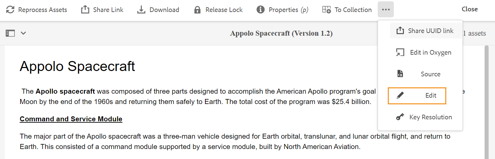

# Iniciar o Editor Web {#id2056B0140HS}

Você pode iniciar o Editor da Web nos seguintes locais:

- [Página Navegação de AEM](#id2056BG00RZJ)
- [Interface do usuário do AEM Assets](#id2056BG0307U)
- [Console de mapa DITA](#id2056BG090BF)

As seções a seguir abordam os detalhes de como você pode acessar e iniciar o Editor da Web de vários locais.

## Página Navegação de AEM {#id2056BG00RZJ}

Ao fazer logon no AEM, é exibida a página Navegação :

{width="800" align="left"}

Clicar no **Editor XML** O link direciona você ao Editor da Web.

{width="800" align="left"}

Como você iniciou o Editor da Web sem selecionar nenhum arquivo, uma tela em branco do Editor da Web é exibida. Você pode abrir um arquivo para edição AEM repositório ou da coleção Favoritos.

## Interface do usuário do AEM Assets {#id2056BG0307U}

Outro local onde você pode iniciar o Editor da Web é a partir da interface do usuário do AEM Assets. Você pode selecionar um ou mais tópicos e abri-los diretamente no Editor da Web. Para abrir um tópico no Editor da Web, siga estas etapas:

1. Na interface do usuário do Assets, navegue até o tópico que deseja editar.

   >[!NOTE]
   >
   > Você também pode ver a UUID do tópico.

   .

   {width="800" align="left"}

   >[!IMPORTANT]
   >
   > Certifique-se de ter as permissões de leitura e gravação na pasta que contém o tópico que deseja editar.

1. Para obter um bloqueio exclusivo sobre o tópico, selecione o tópico e clique em **Check-out**.

   >[!IMPORTANT]
   >
   > Se o administrador tiver configurado a variável **Desativar Edição Sem Check-out** , você deve fazer check-out do arquivo antes de editar. Se você não fizer check-out do arquivo, não poderá ver a opção de edição.

1. Feche o modo de seleção de ativos e clique no tópico que deseja editar.

   A visualização do tópico é exibida.

   Você pode abrir o Editor da Web na exibição de Lista, na exibição de Cartão e no modo de Visualização.

   >[!IMPORTANT]
   >
   > Se quiser abrir vários tópicos para edição, selecione os tópicos desejados na interface do usuário do ativo e clique em Editar. Certifique-se de que o seu navegador não tenha o bloqueador de pop-ups ativado; caso contrário, somente o primeiro tópico na lista selecionada será aberto para edição.

   {width="800" align="left"}

   Se não quiser visualizar um tópico e quiser abri-lo diretamente no Editor da Web, clique no ícone Editar no menu de ação rápida na exibição de cartão:

   {width="800" align="left"}

1. Clique em **Editar** para abrir o tópico no Editor da Web.

   {width="800" align="left"}

## Console de mapa DITA {#id2056BG090BF}

Para abrir o Editor da Web no console do mapa DITA, siga estas etapas:

1. Na interface do usuário do Assets, navegue até o arquivo de mapa DITA que contém o tópico que deseja editar e clique nele.

   O console do mapa DITA é exibido.

1. Clique em **Tópicos**.

   Uma lista de tópicos no arquivo de mapa é exibida. A UUID dos tópicos é exibida abaixo do título do tópico.

1. Selecione o arquivo de tópico que deseja editar.

1. Clique em **Editar tópico**.

   {width="800" align="left"}

1. O tópico é aberto no Editor da Web.

   >[!IMPORTANT]
   >
   > Se o administrador tiver configurado a variável **Desativar Edição Sem Check-out** , você deve fazer check-out do arquivo antes de editar. Se você não fizer check-out do arquivo, o documento será aberto no editor no modo somente leitura.

**Tópico principal:**[ Trabalhar com o editor da Web](web-editor.md)

