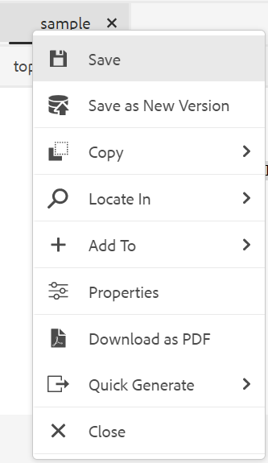
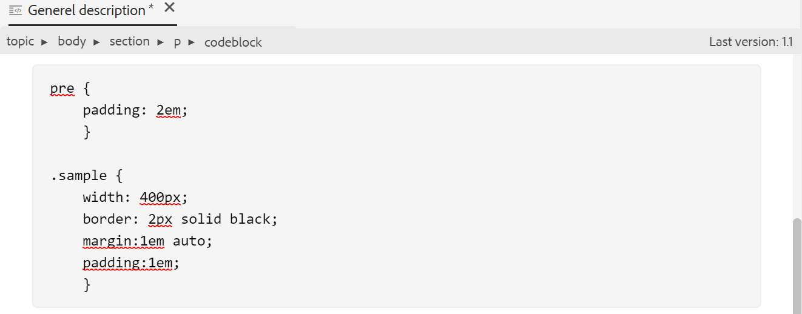

# Outros recursos no Editor da Web {#id2056B0B0YPF}

Há outros recursos úteis no Editor da Web que você pode usar:

**O menu de contexto funciona em uma guia do arquivo**

Ao abrir um arquivo no Editor da Web, você pode executar várias ações no menu de contexto. Você pode ver opções diferentes dependendo se abre um arquivo de mídia, um único arquivo DITA ou vários arquivos.

**Arquivo de mídia**

Você obtém as seguintes funções no menu de contexto da guia de um arquivo de mídia aberto:

{width="300" align="left"}

**Arquivo DITA único**

As seguintes funções são obtidas no menu de contexto da guia de um arquivo aberto:

:   {width="300" align="left"}

**Vários arquivos**

Quando vários arquivos são abertos, você obtém mais opções no menu de contexto:

{width="550" align="left"}

As várias opções no menu de contexto são explicadas abaixo:

***Salvar***: Você pode escolher entre as seguintes opções:

- **Salvar**: Para salvar um arquivo sem criar uma nova versão, selecione **Salvar**. Sempre que você cria um novo tópico, uma cópia funcional sem versão do tópico é criada no DAM. Salvar seu documento atualiza a cópia de trabalho do seu documento no DAM. Salvar esta versão não cria uma nova versão de um tópico. Se o tópico estiver sob revisão, salvar um tópico não dará aos revisores acesso ao conteúdo de tópico alterado.

- **Salvar tudo**: Se houver vários documentos abertos no Editor da Web, você também terá a opção de **Salvar tudo** documentos abertos.

***Salvar como nova versão***

Para criar uma nova versão do arquivo, selecione **Salvar como nova versão**. Para obter mais detalhes sobre **Salvar** e **Salvar como nova versão**, consulte [Conhecer os recursos do Editor da Web](web-editor-features.md#).

***Copiar***: Você pode escolher entre as seguintes opções:

- **Copiar UUID**: Para copiar a UUID do arquivo ativo no momento para a Área de transferência, selecione **Copiar \> Copiar UUID**.
- **Copiar caminho**: Para copiar o caminho completo do arquivo atualmente ativo para a Área de transferência, selecione **Copiar \> Copiar caminho**.

***Localizar em***: Você pode escolher entre as seguintes opções:

- **Mapa**: Se você tiver aberto um mapa DITA grande e quiser encontrar o local exato de um arquivo no mapa, selecione **Localizar no mapa \>**. Ao selecionar a opção Localizar no mapa , o arquivo \(de onde a opção é chamada\) é localizado e realçado na hierarquia do mapa. Para usar esse recurso, você deve abrir o arquivo de mapa no Editor da Web. Se a Visualização de mapa estiver oculta, invocar esse recurso exibirá a Visualização de mapa e o arquivo será realçado na hierarquia de mapa.

- **Repositório**: Semelhante a Localizar no Mapa, a variável **Localizar no repositório \>** mostra o local do arquivo no repositório \(ou DAM\). A Exibição do Repositório é aberta e o arquivo selecionado é realçado no repositório. Se o arquivo estiver em uma pasta, essa pasta será expandida para mostrar o local do arquivo selecionado no repositório.

***Adicionar a***: Você pode escolher entre as seguintes opções:

- **Favoritos**: Para adicionar o arquivo selecionado à coleção favorita, selecione **Adicionar a \> Favoritos**. Para obter mais detalhes, consulte a **Favoritos** descrição do recurso na [Painel esquerdo](web-editor-features.md#id2051EA0M0HS) seção.

- **Conteúdo reutilizável**: Para copiar o arquivo selecionado para a lista de conteúdo reutilizável, selecione **Adicionar a \> Conteúdo Reutilizável**. Para obter mais detalhes, consulte a **Conteúdo reutilizável** descrição do recurso na [Painel esquerdo](web-editor-features.md#id2051EA0M0HS) seção.

***Propriedades***

Para ver a página de propriedades AEM do arquivo selecionado, selecione **Propriedades**.

***Split***: Você pode escolher entre as seguintes opções:

**Para cima, para baixo, para a esquerda ou para a direita**

Por padrão, o Editor da Web permite exibir um tópico de cada vez. Pode haver instâncias em que você gostaria de ver dois ou mais tópicos ao mesmo tempo. Dividir a tela do editor permite exibir vários tópicos ao mesmo tempo. Por exemplo, se você tiver dois tópicos - A e B abertos no editor. Clicando com o botão direito do mouse no tópico B e escolhendo **Dividir \> Para Cima** divide a janela do editor em duas partes. O tópico B é exibido na metade superior e o Tópico A é exibido na metade inferior. Da mesma forma, também é possível dividir a tela horizontalmente selecionando **Dividir \> Esquerda** ou **Dividir \> Direita**. A captura de tela a seguir do Editor da Web exibe tópicos divididos horizontal e verticalmente. Em cada divisão, você pode ter uma exibição diferente. Por exemplo, na captura de tela a seguir, a tela 1 está no modo de exibição Origem, a tela 2 tem dois documentos abertos no modo Autor e a tela 3 está no modo de Visualização. Você pode mover seus documentos de uma tela para outra arrastando a guia Arquivo e soltando-a na tela onde deseja colocá-la. Da mesma forma, também é possível reordenar as guias do arquivo, arrastando-as e movendo-as de acordo com sua preferência.

{width="800" align="left"}

***Geração rápida***

Gere a saída do arquivo selecionado. A saída pode ser gerada somente para arquivos que fazem parte de uma predefinição de saída. Para obter mais detalhes, consulte [Publicação baseada em artigo no Editor da Web](web-editor-article-publishing.md#id218CK0U019I).

***Fechar***: Você pode escolher entre as seguintes opções:

**Fechar**, **Fechar Outros** ou **Fechar tudo**

Se desejar fechar o arquivo do qual você invocou o menu de contexto, selecione **Fechar \> Fechar**. Use **Fechar \> Fechar Outros** para fechar todos os outros arquivos abertos, exceto o arquivo ativo no momento. Para fechar todos os arquivos abertos, selecione o **Fechar \> Fechar tudo** no menu de contexto ou você também pode optar por fechar o Editor da Web. Se houver arquivos não salvos em sua sessão, você será solicitado a salvar esses arquivos.

**Fechar e salvar cenários**

Quando você tenta fechar um arquivo aberto no Editor da Web usando o **Fechar** na guia do arquivo ou na guia **Fechar** no menu Opções, AEM Guias solicita que você salve suas edições e desbloqueie um arquivo bloqueado.

Os prompts são baseados nas seguintes configurações selecionadas pelo administrador:

- **Solicitar check-in ao fechar:** Você tem a opção de fazer check-in no arquivo \(do qual você fez check-out\) ao fechar o editor.
- **Solicitar nova versão ao fechar**: Você tem a opção de salvar o arquivo \(que você editou\) como uma nova versão ao fechar o editor.

Sua experiência de gravação de arquivos dependerá dos três cenários a seguir, nos quais você tem:

- Nenhuma alteração no conteúdo foi feita.
- Conteúdo editado e as alterações foram salvas.
- Conteúdo editado, mas as alterações não foram salvas.

Você pode ver as seguintes opções, dependendo se o arquivo está bloqueado/desbloqueado e se salvou ou não as alterações:

- **Desbloquear e fechar**: O bloqueio no arquivo é liberado e o arquivo é fechado.

   {width="400" align="left"}

- **Salvar como nova versão**: Isso salvará as alterações feitas no conteúdo e criará uma nova versão do arquivo. Você também pode adicionar rótulos e comentários para a versão salva recentemente. Para obter mais informações sobre como salvar uma nova versão, consulte [Salvar como nova versão](web-editor-features.md#save-as-new-version-id209ME400GXA).

- **Desbloquear o arquivo**: Se você optar por desbloquear um arquivo, ele liberará o bloqueio no arquivo e as alterações serão salvas na versão atual do arquivo.

>[!NOTE]
>
> Se você desmarcar a opção para desbloquear o arquivo, também terá a opção de fechar o arquivo sem salvar as alterações.

Por exemplo, um dos prompts é mostrado na seguinte captura de tela:

{width="400" align="left"}

**Dicas visuais para referências quebradas**

- Se o tópico contiver referências cruzadas ou referências de conteúdo, elas serão exibidas em texto vermelho.

**Cópia inteligente - colar**

- Você pode copiar e colar facilmente o conteúdo dentro e entre tópicos. A estrutura do elemento de origem é mantida no destino. Além disso, se o conteúdo copiado contiver referências de conteúdo, mesmo essas serão copiadas.

**Lembrar o último local navegado**

- O Editor da Web fornece uma caixa de diálogo de navegação inteligente de arquivos. O editor lembra do último local usado ao inserir uma referência ou conteúdo. Na primeira vez que você chamar a caixa de diálogo de navegação do arquivo \(por meio de Inserir referência ou Inserir reutilizar conteúdo\), você será levado para o local onde o documento atual é salvo. Na mesma sessão, se tentar inserir outra referência, a caixa de diálogo Navegar no arquivo navegará automaticamente para o local de onde você inseriu a última referência.

>[!NOTE]
>
> No caso de uma imagem, áudio ou arquivo de vídeo, a caixa de diálogo de navegação do arquivo assume o padrão do local do arquivo e não do último local usado.

**Suporte para publicação baseada em artigos**

- No Editor da Web, é possível gerar a saída para um ou mais tópicos, ou para todo o mapa DITA. É necessário criar predefinições de saída para o mapa DITA e gerar facilmente a saída para um ou mais tópicos. Se você atualizou alguns tópicos em seu mapa, também poderá gerar a saída somente para esses tópicos do Editor da Web. Para obter mais detalhes, consulte [Publicação baseada em artigo no Editor da Web](web-editor-article-publishing.md#id218CK0U019I).

**Suporte para documentos Markdown**

- O Editor da Web permite usar documentos do Markdown \(.md\) juntamente com os documentos DITA. Você pode criar e visualizar facilmente um documento do Markdown no Editor da Web e também adicioná-lo ao arquivo de mapa por meio do editor de mapa DITA. Para obter mais detalhes, consulte [Autorizar documentos do Markdown no Editor da Web](web-editor-markdown-topic.md#).

**Tópico de termo do glossário DITA**

- O Editor da Web suporta termos de glossário DITA que você pode inserir adicionando `term` ou `abbreviated-form` elementos.

**Inserir equações de MathML**

- AEM Guias fornece um suporte pronto para uso para inserir equações de MathML por integração com [Web MathType](https://docs.wiris.com/en/mathtype/mathtype_web/intro) aplicativo. Para inserir uma equação de MathML, clique no botão **Inserir elemento** ícone e digite mathml. Quando você seleciona um elemento mathml na lista, a caixa de diálogo Inserir MathML é exibida:

{width="550" align="left"}

Usando as ferramentas de equação do MathML, crie a equação e clique em Inserir para adicioná-la ao documento. A equação é inserida com fundo cinza claro, conforme mostrado abaixo:

{width="400" align="left"}

A qualquer momento, você pode atualizar uma equação clicando com o botão direito do mouse em uma equação existente e selecionando **Editar MathML** no menu de contexto.

**Inserir notas de rodapé**

- Insira a nota de rodapé em seu conteúdo usando o `fn` elemento. No modo de criação, o valor da nota de rodapé é mostrado em linha com o conteúdo. No entanto, quando você alternar para o modo de Visualização ou publicar seu documento, a nota de rodapé será exibida no final do tópico.

**Renomear ou substituir um elemento**

- O Editor da Web exibe a navegação estrutural do elemento na parte superior do tópico. Se quiser trocar ou substituir um elemento por outro elemento, você poderá fazer isso no menu de contexto da navegação estrutural. Por exemplo, você pode trocar `p` elemento com `note` ou qualquer outro elemento válido no contexto.

{width="400" align="left"}

Na navegação estrutural, clique com o botão direito do mouse no nome de um elemento que deseja substituir e selecione Renomear elemento no menu de contexto. A caixa de diálogo Renomear elemento exibe todos os elementos válidos permitidos no local atual. Na caixa de diálogo Renomear elemento, selecione o elemento que deseja usar. O elemento original é substituído pelo novo elemento.

Além do menu de contexto da navegação estrutural, a caixa de diálogo Renomear elemento também pode ser acessada de outros locais:

- Clique no nome do elemento na navegação estrutural para selecionar o conteúdo do elemento e clique com o botão direito do mouse no conteúdo selecionado para exibir o menu de contexto.

- Ative a exibição Tags , clique na tag de abertura de qualquer elemento e clique com o botão direito do mouse no conteúdo selecionado para exibir o menu de contexto.

- Você pode acessar a caixa de diálogo Renomear elemento, chamando o menu Opções de um elemento no painel Contorno.

**Desvincular um elemento**

- Desvincular um elemento permite remover a tag de elemento do texto selecionado e mesclá-la com seu elemento pai. Por exemplo, se você tiver uma `p` elemento dentro de um `note` , você pode desvincular o `p` elemento para mesclar o texto diretamente na `note` elemento. A opção Desvincular elemento está disponível no menu de contexto da navegação estrutural do tópico. Para desvincular um elemento, selecione o elemento da navegação estrutural do tópico, clique com o botão direito do mouse no elemento para abrir o menu de contexto e, finalmente, selecione Desvincular elemento para remover o elemento e mesclar o texto do elemento com seu elemento pai.

**Preservação de quebras de linha e recuo**

- Os elementos DITA que contêm quebra de linha e espaços são suportados e renderizados de acordo com a definição nos modos Autor, Origem ou Visualização e também na saída publicada final. A captura de tela a seguir mostra o conteúdo dentro do `msgblock` elemento no qual as quebras de linha e os espaços \(recuo\) foram preservados:

{width="500" align="left"}

**Gerar ID de elemento automaticamente**

- Você pode gerar IDs automaticamente para os elementos no tópico do DITA. Essas IDs são exclusivas em um tópico DITA. Por exemplo, se você gerar IDs para um elemento de parágrafo, as IDs serão p\_1, p2, p\_3 e assim por diante. Você pode selecionar vários elementos e gerar IDs para cada elemento selecionado.

Faça o seguinte para gerar ID automaticamente para um ou vários elementos:

1. Abra o tópico no editor da Web.
1. Selecione o conteúdo no qual deseja atribuir IDs.
1. Clique com o botão direito do mouse e selecione **Gerar IDs no menu de contexto.**

   Como alternativa, clique com o botão direito do mouse na navegação estrutural e selecione **Gerar IDs**.

**Tópico principal:**[ Trabalhar com o editor da Web](web-editor.md)

