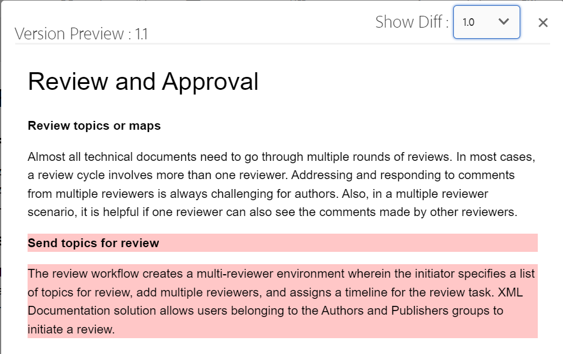

# Visualizar um tópico {#id1696II000QR}

Depois que um tópico é criado, os Guias AEM gera uma pré-visualização do tópico. O modo de Visualização fornece vários recursos que podem ser usados para trabalhar com o documento.

Execute as seguintes etapas para visualizar um tópico:

1. Na interface do usuário do Assets, navegue até o tópico que deseja visualizar.
1. Clique no tópico que deseja visualizar.

   Uma visualização do tópico é exibida na interface do usuário do Assets.

   >[!NOTE]
   >
   > Você pode ver a versão do tópico ativo ou mapa DITA no canto superior direito da guia de arquivo do tópico.

   >[!IMPORTANT]
   >
   > O posicionamento dos seguintes recursos na barra de ferramentas de Visualização pode ser diferente com base na configuração do servidor de AEM. Alguns dos recursos podem estar disponíveis na barra de ferramentas principal, enquanto outros podem estar disponíveis no menu Mais .

## Recursos disponíveis no modo de visualização

{width="800" align="left"}

Você pode executar as seguintes operações na barra de ferramentas no modo de visualização:

**Propriedades**

Exibir as propriedades do tópico selecionado. Com base na sua versão AEM, você pode ver propriedades como metadados, agendar \(de\)ativação, referências, estado do documento e muito mais.

>[!NOTE]
>
> A propriedade de título de um tópico é preenchida automaticamente a partir do `title` do tópico ou mapa DITA. Se você fizer qualquer alteração no título usando a janela de propriedades, a alteração será perdida. Se quiser atualizar a propriedade title, faça isso usando o editor da Web.

A página Propriedades contém informações úteis sobre as referências, como onde um mapa ou tópico está sendo usado ou quais referências estão contidas em um documento. A página Propriedades lista dois tipos de referências para um documento - **Usado em** e **Referências de saída**.

O **Usado em** As referências listam os documentos em que o arquivo atual está sendo referenciado ou usado. O **Referências de saída** lista os documentos referenciados no documento atual.

O ícone \(+\) na **Usado em** a seção de referências permite que você navegue para cima para descobrir onde esse tópico está sendo usado ou referenciado.

{width="800" align="left"}

Clicar no ícone ao lado de um documento mostra o mapa ou os arquivos de tópico em que esse documento está sendo referenciado.

**Filtragem condicional \(A/B\)**

Se o tópico tiver conteúdo condicional, você verá o ícone A/B na barra de ferramentas. Clicar nesse ícone abre uma janela pop-up que permite filtrar o conteúdo de acordo com as condições disponíveis no tópico.

>[!NOTE]
>
> O conteúdo condicional é realçado usando uma cor de fundo clara no Editor da Web.

{width="300" align="left"}

**Editar**

- Abra o tópico para edição no Editor da Web. O **Editar** não estará disponível se o administrador tiver ativado a variável **Desativar Edição Sem Check-out** opção. Com a opção ativada, você verá a variável **Editar** somente após fazer check-out de um arquivo de tópico.

**Resolução de Chave**

- Se quiser usar um arquivo de espaço para o tópico, clique no ícone Resolução da chave . Em seguida, você pode escolher um espaço de chave no pop-up Resolução de chave .

**Origem**

- Abra o código-fonte XML de um arquivo. Você pode exibir o código XML subjacente de um mapa, tópico ou arquivo DITAVAL abrindo o arquivo no modo de Visualização e clicando no ícone Origem. O pop-up Origem XML exibe o código-fonte XML. Você pode selecionar um código específico no arquivo ou pressionar `Ctrl`+`a` para selecionar o conteúdo inteiro.

   >[!NOTE]
   >
   > Para obter a visualização do código-fonte de um arquivo de mapa DITA, selecione o arquivo na interface do usuário do Assets e clique em Origem.

   {width="800" align="left"}

**Compartilhar link UID**

- AEM Guias permite compartilhar os links baseados em UUID para mapas DITA, tópicos e arquivos de imagem dos seguintes locais:

   - Interface do usuário do Assets
   - Console do mapa DITA
   - Visualização do tópico ou da imagem

Uma nova opção **Compartilhar link UID** é mostrado na barra de ferramentas das áreas acima mencionadas. A captura de tela a seguir mostra o **Compartilhar link UID** no modo de Visualização de um tópico:

{width="800" align="left"}

Na interface do usuário do ativo, essa opção fica visível ao selecionar um arquivo. No modo de Visualização, essa opção está disponível na barra de ferramentas principal por padrão. Em um console de mapa DITA, essa opção fica visível na seção Predefinições de saída .

Depois de copiar o URL, o mesmo poderá ser compartilhado com outros usuários para conceder a eles acesso direto ao arquivo. Esse link permanece válido mesmo quando o arquivo é movido para outro local no repositório. A única vez que o link falhar é quando o arquivo é excluído do repositório.

Se você compartilhar o link do console do mapa DITA ou de um modo de visualização de arquivo, o usuário levou para a mesma exibição do arquivo. No entanto, quando você compartilha o link de um arquivo de mapa da interface do usuário do Assets, o usuário é levado para o console do mapa. Da mesma forma, para um tópico ou arquivo de imagem, a visualização do arquivo é mostrada.

>[!IMPORTANT]
>
> O link não pode ser usado como um link de referência em outro tópico. Ele somente fornece acesso direto ao arquivo no repositório. Além disso, o link permanece válido desde que o arquivo esteja disponível no repositório. Mesmo que o arquivo seja movido para outro local no repositório, o link permanecerá válido. O link só falhará quando o arquivo for excluído do repositório.

**Fazer check-out/check-in**

- Alterna os recursos de Check-out e Check-in . Quando o check-out de um arquivo é feito, o usuário atual recebe uma permissão exclusiva de gravação no arquivo. Um arquivo com check-out pode ser aberto no Editor da Web para edição. Depois de fazer as alterações necessárias, clique no ícone Check-in para salvar o arquivo no DAM.

Quando você faz check-out de um tópico, o status do arquivo é mostrado como check-out na exibição de cartão e na exibição de lista.

Arquivo com check-out na exibição de cartão:

{width="300" align="left"}

Arquivo com check-out na exibição de lista:

{width="550" align="left"}

Se a coluna Check-out não estiver visível, selecione **Exibir configurações** under **Exibição de lista** e selecione o **Check-out** no **Configurar colunas** caixa de diálogo.

{width="800" align="left"}

>[!TIP]
>
> Consulte a seção Controle de versão do conteúdo no guia de práticas recomendadas para obter as práticas recomendadas de trabalho com check-out e check-in de arquivo.

**Diferença de versão baseada na Web**

- Se seu tópico sofreu algumas mudanças, você pode descobrir facilmente as alterações feitas em diferentes versões desse tópico. Para descobrir alterações em diferentes versões de um tópico:

   >[!IMPORTANT]
   >
   > O método descrito no procedimento a seguir é aplicável somente para arquivos DITA. Para arquivos não DITA, use a exibição Linha do tempo para criar versões ou restaurar uma versão existente de um arquivo.

   1. Abra o tópico no modo de Visualização.

   1. No painel à esquerda, clique em **Histórico da versão** e selecione uma versão.

      {width="800" align="left"}

   1. Nas versões listadas, selecione aquela que deseja usar como a versão base e clique em **Versão de visualização**. A visualização da versão selecionada é mostrada na janela Visualização da versão .

   1. No **Mostrar Diff** selecione a versão com a qual deseja comparar a versão base.

      {width="800" align="left"}

      O conteúdo alterado é destacado na visualização do tópico. O conteúdo destacado em verde significa que o conteúdo recém-adicionado e o conteúdo em vermelho é o conteúdo excluído.

      {width="800" align="left"}

### Ramificação, reversão e controle de versão subsequente {#id193PG0Y051X}

- Em um ambiente de criação típico, é necessário criar uma nova ramificação de um tópico para atender a uma versão específica. Assim como qualquer outro sistema de gerenciamento de versão, os Guias de AEM permitem criar uma ramificação de uma versão existente de um tópico ou reverter para uma versão mais antiga de um tópico. Com os recursos de gerenciamento de versão oferecidos pelos Guias AEM, é possível executar as seguintes tarefas:

   - Criar uma ramificação de uma versão existente de um tópico
   - Criar versões subsequentes em uma nova ramificação
   - Reverter para uma versão específica de um tópico

   A ilustração a seguir mostra o sistema típico de ramificação e versão subsequente:

   {width="550" align="center"}

   Para qualquer novo tópico, a primeira versão é numerada como 1.0. Depois disso, todas as novas versões do tópico são salvas com um número incremental, como 1.1, 1.2 e assim por diante. Depois de criar uma ramificação de um tópico, uma nova ramificação será criada levando o número da versão de onde a ramificação é criada e adicionando um .0 ao final da versão. Como visto na ilustração, uma nova ramificação é criada a partir da versão 1.1 de um tópico. A nova ramificação tem o controle de versão 1.1.0. Em seguida, toda vez que você salvar uma nova versão do tópico nessa ramificação, ela receberá um número de versão incremental, como 1.1.1, 1.1.2 e assim por diante.

   Semelhante à ramificação, também é possível reverter a versão atual ou em funcionamento para qualquer versão existente no repositório. Para reverter para uma versão, basta selecionar a versão desejada do tópico e clicar em **Reverter para esta versão** no **Histórico da versão** painel.

   Execute as seguintes etapas para criar uma ramificação, reverter para uma versão e manter versões subsequentes de um tópico:

   >[!IMPORTANT]
   >
   > O método descrito no procedimento a seguir é aplicável somente para arquivos DITA. Para arquivos não DITA, use a exibição Linha do tempo para criar versões ou restaurar uma versão existente de um arquivo.

   1. Acesse o tópico na interface do usuário do Assets.

      >[!NOTE]
      >
      > Também é possível abrir o tópico no modo de Visualização e prosseguir com a Etapa 3.

   1. Selecione o tópico para o qual deseja criar uma ramificação.

   1. No painel à esquerda, clique em **Histórico da versão**.

      >[!NOTE]
      >
      > Uma lista de versões disponíveis para o tópico selecionado é exibida. Cada versão contém o carimbo de data e hora, o nome de usuário, o comentário da versão e [label](web-editor-use-label.md#) informações.

   1. Selecione uma versão de onde deseja criar uma ramificação. Na captura de tela a seguir, a versão 1.2 é selecionada para criar uma ramificação.

      {width="300" align="left"}

      >[!NOTE]
      >
      > A versão atual de um tópico contém *\(Atual\)* mencionado ao lado do número da versão.

   1. Clique em **Reverter para esta versão**.

      Será exibida uma mensagem solicitando que você confirme a criação de uma nova ramificação.

   1. *\(Opcional\)* No prompt de mensagem, você terá a opção de selecionar a variável **Salvar A Cópia De Trabalho Atual Como Uma Nova Versão**. As duas ações a seguir são possíveis com base na seleção dessa opção:

      - Se você selecionar essa opção, uma ramificação será criada a partir da versão 1.1. E uma nova versão do tópico também será criada a partir da cópia funcional atual do tópico e salva como a próxima versão - 1.4.

         {width="300" align="left"}

         A versão 1.2 torna-se a sua cópia de trabalho atual do tópico. Qualquer versão salva depois disso é criada na nova ramificação 1.1. Por exemplo, a versão subsequente de um novo tópico nesta ramificação será salva como 1.2.0.

         {width="300" align="left"}

      - Se você não selecionar essa opção, nenhuma nova versão da cópia de trabalho atual do tópico será criada. Uma nova ramificação é criada a partir da versão 1.2 do tópico. Qualquer versão subsequente do tópico é salva na ramificação 1.2 como 1.2.0, 1.2.1 e assim por diante.

         {width="300" align="left"}
   1. Clique em **OK**.
   Uma nova ramificação é criada a partir da versão selecionada do tópico. O processo acima também é aplicável para reverter para uma versão específica de um tópico. Reverter para uma versão específica tecnicamente significa criar uma nova ramificação da versão selecionada e tornar essa versão a cópia funcional atual do tópico. Você também pode visualizar o histórico dos arquivos que foram revertidos no relatório Histórico de Reversão. Para obter mais detalhes sobre este relatório, consulte [Relatório de histórico de versão dos arquivos revertidos](reports-reverted-file-version-history.md#).

**Tópico principal:**[ Criar e visualizar tópicos](create-preview-topics.md)

